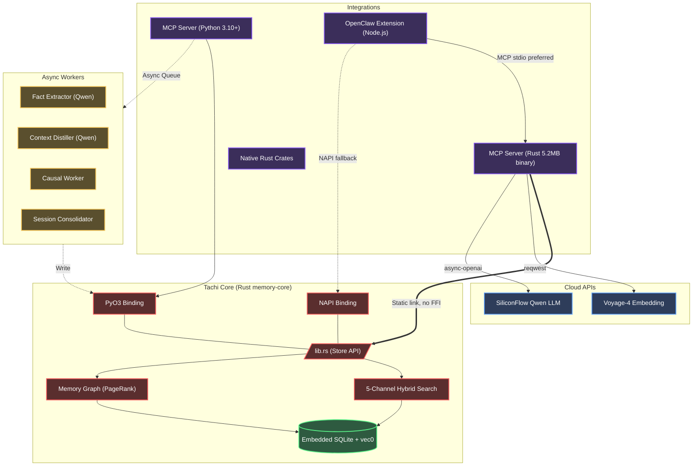

<div align="center">
  
  <h1>✧ Tachi</h1>
  <p><strong>A Fast, Local-First Context & Memory Database for Autonomous AI Agents</strong></p>

  <p>
    <a href="README.en.md"><b>English</b></a> | <a href="README.zh-CN.md">简体中文</a> | <a href="README.md">文言文</a>
  </p>

  <p>
    <a href="https://www.gnu.org/licenses/agpl-3.0"></a>
    
    
    
    
    
  </p>
</div>

---

## 📖 Table of Contents

- [Overview](#-overview)
- [Why Tachi?](#-why-tachi)
- [Quick Start: Coding Agents (MCP)](#-quick-start-coding-agents-mcp)
- [Quick Start: Frameworks (OpenClaw)](#-quick-start-frameworks-openclaw)
- [Key Features](#-key-features)
- [Causal Worker Pipeline & Memory Relations](#-causal-worker-pipeline--memory-relations)
- [Architecture](#-architecture)
- [Model Stack](#-model-stack)
- [Manual Installation & APIs](#-manual-installation--apis)
- [Environment Configuration](#-environment-configuration)
- [Benchmarks](#-benchmarks)
- [Contributing](#-contributing)
- [License](#-license)

---

## 💡 Overview

**Tachi** is an embedded, unified context and memory management database engineered for Autonomous AI Agents. Named after Ghost in the Shell's Tachikoma — AI units that evolve through shared memory.

Standard memory models often rely on flat vector stores, leading to bloated context windows and a loss of temporal and causal relationships. Tachi addresses this by utilizing a **hierarchical, file-system-like paradigm** combined with **graph-based causal relations**, powered by a highly optimized Rust core. 

Whether integrated as a [Model Context Protocol (MCP)](https://modelcontextprotocol.io/) server or used as a native extension in frameworks like OpenClaw, Tachi delivers sub-millisecond, multi-modal semantic retrieval with **zero external database dependencies**.

---

## 🎯 Why Tachi?

1. **Solving "Context Bloat" and "Causal Amnesia"**
Traditional agents dump unstructured fragments into flat vector databases (like Chroma or Pinecone). Over time, this leads to bloated LLM context windows and a complete loss of logical sequencing. Tachi counteracts this with hierarchical namespaces, 3-tier adaptive summarization (L0/L1/L2), and Knowledge Graph Edges — transforming scattered text into a structured, evolving "Digital Hippocampus".

2. **Uncompromising Local Performance & Data Sovereignty**
An AI's long-term operational memory is its most sensitive asset. Tachi is 100% local, powered by an ultra-fast Rust core (`sqlite-vec` + native FTS5) with zero network database dependencies. Its dual-DB architecture safely isolates global user preferences from project-specific knowledge bases, all while delivering sub-millisecond retrieval vectors out of the box.

3. **Ending the MCP "Process Chaos"**
In a multi-agent future, having every agent spawn and manage its own fragile MCP child processes leads to massive resource waste, port conflicts, and zombie processes. The Tachi Hub acts as a unified Proxy and Capability Registry. Register a tool once, and every agent magically shares connections, idle-cleanup, circuit breakers, and sanitized resilient network environments.

4. **"Pristine" Memory Lifecycle**
Long-running autonomous operations require extreme hygiene to prevent hallucination drift. Tachi introduces rigorous lifecycle management: pre-save AI noise filtering (`is_noise_text`), automated background garbage collection (GC), and CASCADE hard deletions (`delete_memory`). This ensures the memory store stays pristine and contextually relevant after months of continuous operations.

5. **Skill Slots: On-Demand "Neural Extensions"**
Tachi isn't just about routing tools; it's about standardizing complex workflows. Through "Skill Slots" (`Skill-as-a-Tool`), developers can encapsulate prompt chains, SOPs, and domain-specific knowledge into simple markdown files. Tachi automatically compiles these into Native MCP tools. Agents are no longer weighed down by massive system prompts—they simply "plug into" Tachi to instantly acquire on-demand professional skills.

---

## 🤖 Quick Start: Coding Agents (MCP)

For environments like Claude Desktop, Cursor, or AutoGen, Tachi operates natively as an MCP server.

**Prompt your Assistant with the following instructions:**

```text
Please configure the Tachi local memory MCP server:

1. Clone repository: git clone https://github.com/kckylechen1/tachi.git && cd Tachi

[Option A] Python Runtime:
   cd mcp && python3 -m venv .venv && source .venv/bin/activate
   cd ../crates/memory-python && pip install maturin && maturin develop --release
   cd ../../mcp && pip install -r requirements.txt
   Configure mcp_config.json:
   {
     "mcpServers": {
       "memory": {
         "command": "<absolute-path>/Tachi/mcp/.venv/bin/python3",
         "args": ["<absolute-path>/Tachi/mcp/server.py"]
       }
     }
   }

[Option B] Native Rust Binary (Fastest — Recommended):
   brew tap kckylechen1/tachi && brew install tachi
   Configure mcp_config.json:
   {
     "mcpServers": {
       "tachi": {
         "command": "tachi",
         "env": {
           "VOYAGE_API_KEY": "...",
           "SILICONFLOW_API_KEY": "..."
         }
       }
     }
   }

The server loads API keys from the `.env` file in the project root (see `.env.example`).
Required providers:
- Voyage API (Embedding + Rerank): https://dash.voyageai.com/
- At least one OpenAI-compatible chat provider for extraction / reasoning lanes
  - SiliconFlow is the default extraction path used by the bundled examples
  - Additional lane-specific providers can be configured via `EXTRACT_*`, `DISTILL_*`, `SUMMARY_*`, and `REASONING_*`

IMPORTANT Database Safety Rules:
- NEVER place the database file in a cloud-synced folder (iCloud, Dropbox, OneDrive, Google Drive). SQLite WAL mode is incompatible with network filesystems.
- Ensure only ONE memory-server instance accesses the same database file. The server enforces this via file lock, but do not bypass it.
- Do NOT use `sqlite3` CLI to write to the database while the server is running. Read-only queries with `PRAGMA busy_timeout = 5000` are acceptable.
- On unclean shutdown, the server auto-recovers FTS index on next startup.
```

---

## 🦞 Quick Start: Frameworks (OpenClaw)

Tachi can be integrated as a native OpenClaw extension plugin.

**Prompt your OpenClaw IDE Assistant with the following instructions:**

```text
Please install the Tachi memory extension for OpenClaw:

1. One-command install for Tachi + the OpenClaw plugin (recommended):
   bash -c "$(curl -fsSL https://raw.githubusercontent.com/kckylechen1/tachi/main/scripts/install.sh)"

   The installer will:
   - install or upgrade `tachi` through Homebrew
   - download and install the OpenClaw `tachi` plugin
   - auto-update `~/.openclaw/openclaw.json` when present, including `plugins.allow`, `plugins.load.paths`, and `plugins.slots.memory = "tachi"`

   If you only want the legacy OpenClaw-plugin-only flow, run:
   bash -c "$(curl -fsSL https://raw.githubusercontent.com/kckylechen1/tachi/main/scripts/install_openclaw_ext.sh)"

   Optional: auto-detect local agent configs and inject a Tachi MCP entry:
   python3 scripts/setup_agent_mcp.py --apply

   Optional: auto-register local skills/MCPs into Hub:
   python3 scripts/load_skills_to_hub.py
   python3 scripts/register_mcps_to_hub.py
   # By default this also syncs local agent mcp configs and consolidates direct MCP entries registered in Hub under tachi
   # Skip this behavior with: python3 scripts/register_mcps_to_hub.py --no-sync-agent-config

2. If the installer cannot locate `openclaw.json`, confirm manually:
   - `plugins.allow` includes `tachi`
   - `plugins.slots.memory` is set to `tachi`

3. Configure API keys in the project root `.env` file (see `.env.example`):
   - `VOYAGE_API_KEY` for embedding + rerank
   - `SILICONFLOW_API_KEY` for the default extraction lane
   - Optional per-lane overrides: `EXTRACT_*`, `DISTILL_*`, `SUMMARY_*`, `REASONING_*`

Operational notes:
- Current OpenClaw runtime topology is per-agent: `data/agents/<agent>/memory.db`.
- The root `data/memory.db` is legacy-only and should be treated as historical or migration data, not the active write target.
- If you want the latest local binary after a release, prefer `brew reinstall tachi` after the tap formula is updated, or point agents directly at a freshly built `target/release/memory-server`.
```

---

## ✨ Key Features

- **⚡ High-Performance Rust Core (`memory-core`)**: The foundational scoring, storage, entity extraction, and retrieval engines are written in Rust, featuring dynamic bindings for Node.js (`NAPI-RS`, optional) and Python (`PyO3`). The OpenClaw plugin communicates via MCP stdio by default, with NAPI as an optional fallback. Built-in tools plus registered proxy/skill tools are exposed dynamically.
- **🗂️ Filesystem Paradigm**: Context is managed hierarchically via a `path` parameter (e.g., `/user/preferences`, `/project/architecture`), allowing precise isolation and contextual scoping.
- **🔍 3-Channel Hybrid Search Engine**:
  - **Semantic**: Built-in vector embedding search via `sqlite-vec` (KNN).
  - **Lexical**: Native CJK-optimized full-text search utilizing `libsimple` and `FTS5`.
  - **Decay**: Temporal relevance degradation inspired by the ACT-R cognitive architecture.
- **🔒 Hard State Engine**: Introduced a deterministic Key-Value store independent of vector memory. Useful for tracking trading watchlists or rigid state.
- **🧠 3-Tier Context Extraction**: Automatically parses ingestion into three tiers: `L0` (Abstract Summary), `L1` (Overview), and `L2` (Full Text). Agents dynamically retrieve the appropriate depth based on context constraints.
- **🔄 Evolution Deduplication**: Utilizing math-based similarities for `HARD_SKIP` and `EVOLVE` updates.
- **🔌 Dual-DB Architecture**: Global memories (`~/.Tachi/global/memory.db`) shared across all projects, plus per-project memories (`.Tachi/memory.db` at git root) for project-scoped context. Automatic git root detection and legacy migration. No external databases required.
- **🎯 Tachi Hub**: A unified capability registry for Skills, Plugins, and MCP Servers. Register once, discover from any agent. Includes usage tracking, feedback metrics, and dual-DB inheritance (project overrides global). Preloaded skill count is runtime-dependent (based on installed skill packs).
- **🔀 MCP Proxy**: Register child MCP servers once in Tachi — with `tool_exposure=flatten` they appear as `server__tool`, or with `tool_exposure=gateway` they stay compact behind `hub_call`. Shared connection pool with lazy-connect, idle cleanup, circuit breaker, and per-child concurrency control. Sanitized env with 21 preserved system variables. Transport aliases (`http`, `streamable-http` → `sse`). No more zombie processes.
- **🗑️ Memory Lifecycle Management**: Full lifecycle control with `delete_memory` (permanent removal with CASCADE cleanup), `archive_memory` (soft-delete with recovery), and `memory_gc` (prune stale access history, old events, and audit log entries).
- **🧹 Noise Filtering**: Automatic rejection of junk text on save (`is_noise_text`) and meaningless queries on search (`should_skip_query`). Saves embedding API costs and keeps the memory store clean. Bypassable via `force=true`.
- **🩺 Vector Backfill Maintenance**: `tachi backfill-vectors --db <path> [--dry-run]` audits any store for missing embeddings and fills them in batch, which is especially useful after migrations or when agent-local DBs fall behind.
- **⏰ Background Garbage Collection**: Periodic background GC timer (default: every 6 hours, configurable via `MEMORY_GC_INTERVAL_SECS`). Keeps growing tables bounded without manual intervention.
- **🕸️ Knowledge Graph Tools**: Direct graph manipulation via `add_edge` and `get_edges` MCP tools. Create causal, temporal, and entity relationship edges with metadata and weights.
- **🔗 Auto-Link on Save**: `save_memory` automatically discovers existing memories sharing the same entities and creates graph edges between them (async, non-blocking). Enabled by default, disable with `auto_link=false`.
- **👤 Agent Profiles**: Each agent session can register its identity via `agent_register` — declaring an agent ID, display name, capabilities, tool allowlist (glob patterns), and per-agent rate limit overrides. Query the current profile with `agent_whoami`. Profiles are session-scoped and in-memory.
- **🧾 Provenance on Write**: New writes now carry `metadata.provenance` with the calling tool, resolved DB scope/path, registered agent profile, and optional `TACHI_PROFILE` / `TACHI_DOMAIN` tags so conflicts and stale memories are easier to audit later.
- **🤝 Cross-Agent Handoff**: When an agent session ends, it can leave a structured handoff memo via `handoff_leave` (summary, next steps, target agent, context). The next agent calls `handoff_check` at startup to pick up pending work. Memos are persisted both in-memory and to the global store (`category="handoff"`) for cross-restart durability.
- **⚡ Rate Limiter & Loop Detection**: Per-session sliding window RPM enforcement and identical-call burst detection (same tool + args within 60s). Default: RPM unlimited, burst limit 8. Configurable via `RATE_LIMIT_RPM` and `RATE_LIMIT_BURST` env vars, or per-agent via `agent_register`.
- **📤 Skill Export**: `hub_export_skills` exports Hub skills to agent-specific formats — Claude (SKILL.md + symlinks), OpenClaw (plugin manifest), Cursor (.mdc rules), and generic (raw markdown). Supports visibility filtering, skill ID selection, agent-local scope filtering, and clean mode.
- **🧬 Skill Evolution**: `skill_evolve` uses LLM analysis of the current prompt, usage feedback, and success/failure metrics to generate an improved skill version. Creates versioned capabilities (`skill:name/vN`) with optional auto-activation and dry-run mode.
- **🔮 Virtual Capabilities**: An abstraction layer above Hub capabilities. Register VCs (`vc:*`), bind to multiple concrete MCP backends with priority ordering, resolve at call time with deterministic priority + version pinning. Sandbox policies inherit from VC to concrete backend.
- **🔐 Tachi Vault (Encrypted Secret Storage)**: Local-first encrypted vault for API keys and secrets. Argon2id KDF + AES-256-GCM encryption with per-secret nonces. 9 MCP tools for full lifecycle (`vault_init`, `vault_unlock`, `vault_lock`, `vault_set`, `vault_get`, `vault_list`, `vault_remove`, `vault_status`, `vault_setup_rotation`). Auto-lock after 30min inactivity, brute-force protection (5 failed attempts → 5min lockout), per-secret agent ACLs (`allowed_agents`), and full audit logging. Multi-key rotation with round-robin, random, and LRU strategies.
- **📧 Agent Kanban (Global-Only)**: Cross-agent communication via kanban cards with global-only storage. ACPX protocol extensions (`ack`, `progress`, `result` card types) for structured request/response flows. Workspace and conversation context metadata with filtering support. Kanban card GC for auto-pruning stale resolved/expired cards.

---

## ⚙️ Causal Worker Pipeline & Memory Relations

Tachi incorporates advanced reasoning components to maintain long-term logical consistency (Note: this pipeline is **disabled by default** to prioritize latency; enable it with `ENABLE_PIPELINE=true`):

### 1. The Causal Extraction Pipeline
When an agent submits execution logs, an asynchronous worker can route extraction, compaction, and evolution prompts through dedicated model lanes. The default extraction lane uses **Qwen3.5-27B** via SiliconFlow to analyze the interaction and extract:
*   `Causes`: The events triggering the action.
*   `Decisions`: The reasoning pathway and logic applied.
*   `Results`: The concrete outcomes.
*   `Impacts`: Long-term consequences within the workspace.

### 2. Derived Isolation
Both causal derivations and distilled rules are physically isolated within a dedicated `derived_items` table, keeping the primary memory layers pure and intact from automated AI-inferred hallucinations.

---

## 🏗️ Architecture



---

## 🧩 Model Stack

Tachi now exposes separate text lanes so you can tune extraction, compaction, summary, and reasoning independently.

Current benchmark-backed guidance:

| Lane | Recommended Model | Why |
|------|-------------------|-----|
| **Embedding / Rerank** | [Voyage-4](https://voyageai.com/) | Best retrieval quality in local A/B tests; remains the default vector backbone. |
| **Extract** | [Qwen3.5-27B](https://cloud.siliconflow.cn/) via SiliconFlow | Most reliable structured fact extraction in the current Tachi/OpenClaw benchmarks. |
| **Distill** | MiniMax M2.7 (when available through a compatible gateway) | Best compaction fidelity and reusable context blocks in round-2 lane tests. |
| **Summary** | MiniMax M2.7 (when available through a compatible gateway) | Strongest low-token status summaries while preserving useful signal density. |
| **Reasoning / Skill Audit** | GLM-5.1 via Z.AI | Best architectural judgment, evolution prioritization, and skill audit final-pass decisions. |
| **Fast Pre-Audit / Scout (Optional)** | Gemini Flash or MiniMax M2.7 | Useful for cheap first-pass scanning before a GLM final decision. |

Implementation note:
- The current Rust client speaks OpenAI-compatible chat completions directly.
- If a provider is exposed as Anthropic-style messages in your host runtime, route it through a compatible gateway before pointing `DISTILL_*` / `SUMMARY_*` at it.
- The default out-of-the-box release path remains fully usable with Voyage + SiliconFlow, while the lane configuration lets you override individual roles as your gateways mature.

---

## 💻 Manual Installation & APIs

For direct integration of `memory-core` into custom Python applications:

### ⚙️ Python Environment (`mcp/server.py`)
```python
from mcp.server.stdio import stdio_server
# ... (using MCP client communication)

# 1. Ingest structured soft memory
save_memory(
    text="The user prefers React frontend with Vite, no Webpack. Tailwind is permitted.",
    path="/user/project_preferences",
    importance=0.8,
    keywords=["react", "vite", "webpack", "tailwind"]
)

# 2. Execute multi-channel Hybrid Search
results = search_memory(
    query="What is the preferred bundler?",
    path_prefix="/user",
    top_k=3
)

# 3. Save Hard State (0 embedding, deterministic KV)
set_state(
    namespace="trading",
    key="watchlist",
    value={"600089": "TBEA", "688256": "Cambricon"}
)
```

### ⚙️ Environment Configuration (`.env`)
Copy `.env.example` to `.env` in the root directory.
```bash
# Core Embedding and Retrieval
VOYAGE_API_KEY="your_voyage_key_here"

# Shared OpenAI-compatible default lane
SILICONFLOW_API_KEY="your_siliconflow_key_here"
SILICONFLOW_BASE_URL="https://api.siliconflow.cn/v1/chat/completions"
SILICONFLOW_MODEL="Qwen/Qwen3.5-27B"

# Optional per-lane overrides
EXTRACT_API_KEY=""
EXTRACT_BASE_URL=""
EXTRACT_MODEL="Qwen/Qwen3.5-27B"

DISTILL_API_KEY=""
DISTILL_BASE_URL=""
DISTILL_MODEL=""

SUMMARY_API_KEY=""
SUMMARY_BASE_URL=""
SUMMARY_MODEL=""

REASONING_API_KEY=""
REASONING_BASE_URL=""
REASONING_MODEL=""

# Database path (Optional — auto-resolves to ~/.Tachi/global/memory.db + .Tachi/memory.db per project)
MEMORY_DB_PATH="~/.Tachi/global/memory.db"
```

Operational note:
- The Rust release currently expects OpenAI-compatible chat-completions endpoints for lane overrides.
- Host runtimes like OpenClaw may already know about Anthropic-style providers (for example MiniMax or Kimi). In that case, either keep those providers in the host for now or route them through an OpenAI-compatible gateway before wiring them into Tachi.

---

## 🛡️ Database Safety

> **Important**: Tachi uses SQLite in WAL mode for maximum single-writer performance. Violating the rules below may corrupt the database.

| Rule | Why |
|------|-----|
| **Single instance only** | The server acquires an exclusive file lock (`memory.db.lock`) at startup. If you see "Another memory-server instance is already running", stop the duplicate process. |
| **No cloud-synced paths** | iCloud, Dropbox, OneDrive, and Google Drive are **incompatible** with SQLite WAL. Use a local-only directory (e.g., `~/.Tachi/`). |
| **No concurrent CLI writes** | Do not run `sqlite3` INSERT/UPDATE on the database while the server is running. Read-only queries are safe with `PRAGMA busy_timeout = 5000`. |
| **Auto-recovery on startup** | The server runs `PRAGMA quick_check` on startup and auto-backfills an empty FTS index from the main `memories` table. |
| **Graceful shutdown** | The server handles SIGINT/SIGTERM to flush WAL and run `PRAGMA optimize` before exit. Avoid `kill -9`. |

---

## 🏎️ Benchmarks

- **P95 Latency (Rust Core)**: `< 1.2ms` for localized hybrid lookups.
- **Extraction Parallelism**: Background thread pools manage extraction with strict isolation from the main event loop.
- **Token Efficiency**: The hierarchical `L0` → `L1` → `L2` context tiering reduces prompt context bloat by up to **85%** compared to standard RAG chunking, significantly enhancing instruction adherence.

---

## 🤝 Contributing

Contributions to Tachi are welcome. To establish a local development environment:
1. Ensure Rust (`rustc>=1.75`) is installed.
2. Install build utilities: `cargo install maturin cargo-watch`.
3. The core storage API is located at `crates/memory-core/src/lib.rs`.
4. Validate changes utilizing `cargo test --all` prior to submitting a pull request.

Commit messages must conform to the [Conventional Commits](https://www.conventionalcommits.org/) specification.

---

## 📜 License

[AGPLv3 License](LICENSE) © 2026 Tachi Authors.
