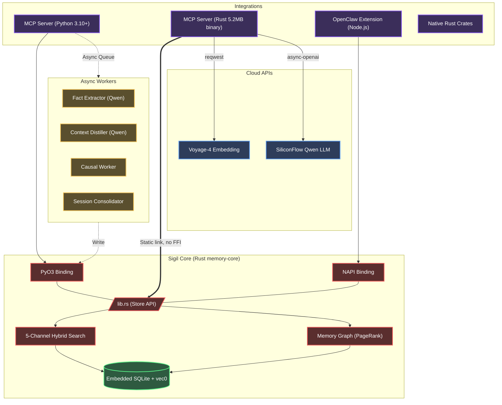

<div align="center">
  
  <h1>✧ Sigil</h1>
  <p><strong>A Fast, Local-First Context & Memory Database for Autonomous AI Agents</strong></p>

  <p>
    <a href="README.en.md"><b>English</b></a> | <a href="README.zh-CN.md">简体中文</a> | <a href="README.md">文言文</a>
  </p>

  <p>
    <a href="https://www.gnu.org/licenses/agpl-3.0"></a>
    
    
    
    
    
  </p>
</div>

---

## 📖 Table of Contents

- [Overview](#-overview)
- [Quick Start: Coding Agents (MCP)](#-quick-start-coding-agents-mcp)
- [Quick Start: Frameworks (OpenClaw)](#-quick-start-frameworks-openclaw)
- [Key Features](#-key-features)
- [Causal Worker Pipeline & Memory Relations](#-causal-worker-pipeline--memory-relations)
- [Architecture](#-architecture)
- [Model Stack](#-model-stack)
- [Manual Installation & APIs](#-manual-installation--apis)
- [Environment Configuration](#-environment-configuration)
- [Benchmarks](#-benchmarks)
- [Contributing](#-contributing)
- [License](#-license)

---

## 💡 Overview

**Sigil** is an embedded, unified context and memory management database engineered for Autonomous AI Agents.

Standard memory models often rely on flat vector stores, leading to bloated context windows and a loss of temporal and causal relationships. Sigil addresses this by utilizing a **hierarchical, file-system-like paradigm** combined with **graph-based causal relations**, powered by a highly optimized Rust core. 

Whether integrated as a [Model Context Protocol (MCP)](https://modelcontextprotocol.io/) server or used as a native extension in frameworks like OpenClaw, Sigil delivers sub-millisecond, multi-modal semantic retrieval with **zero external database dependencies**.

---

## 🤖 Quick Start: Coding Agents (MCP)

For environments like Claude Desktop, Cursor, or AutoGen, Sigil operates natively as an MCP server.

**Prompt your Assistant with the following instructions:**

```text
Please configure the Sigil local memory MCP server:

1. Clone repository: git clone https://github.com/kckylechen1/sigil.git && cd sigil

[Option A] Python Runtime:
   cd mcp && python3 -m venv .venv && source .venv/bin/activate
   cd ../crates/memory-python && pip install maturin && maturin develop --release
   cd ../../mcp && pip install -r requirements.txt
   Configure mcp_config.json:
   {
     "mcpServers": {
       "memory": {
         "command": "<absolute-path>/sigil/mcp/.venv/bin/python3",
         "args": ["<absolute-path>/sigil/mcp/server.py"]
       }
     }
   }

[Option B] Native Rust Binary (Fastest):
   cargo build -p memory-server --release
   Configure mcp_config.json:
   {
     "mcpServers": {
       "memory": {
         "command": "<absolute-path>/sigil/target/release/memory-server",
         "env": {
           "VOYAGE_API_KEY": "...",
           "SILICONFLOW_API_KEY": "...",
           "MEMORY_DB_PATH": "~/.sigil/memory.db"
         }
       }
     }
   }

The server loads API keys automatically from the `.env` file in the project root.
Required providers:
- Voyage API (Embedding + Rerank): https://dash.voyageai.com/
- SiliconFlow (Extraction): https://cloud.siliconflow.cn/

IMPORTANT Database Safety Rules:
- NEVER place the database file in a cloud-synced folder (iCloud, Dropbox, OneDrive, Google Drive). SQLite WAL mode is incompatible with network filesystems.
- Ensure only ONE memory-server instance accesses the same database file. The server enforces this via file lock, but do not bypass it.
- Do NOT use `sqlite3` CLI to write to the database while the server is running. Read-only queries with `PRAGMA busy_timeout = 5000` are acceptable.
- On unclean shutdown, the server auto-recovers FTS index on next startup.
```

---

## 🦞 Quick Start: Frameworks (OpenClaw)

Sigil can be integrated as a native OpenClaw extension plugin.

**Prompt your OpenClaw IDE Assistant with the following instructions:**

```text
Please install the Sigil memory extension for OpenClaw:

1. Execute the installation script:
   bash -c "$(curl -fsSL https://raw.githubusercontent.com/kckylechen1/sigil/main/scripts/install_openclaw_ext.sh)"

2. The script automates cloning, building the Rust NAPI module, compiling the extension, and symlinking to the OpenClaw plugin directory.

3. Enable `memory-hybrid-bridge` in `plugins.allow`, assign `plugins.slots.memory` to `memory-hybrid-bridge`, and configure API keys in `.env`.
```

---

## ✨ Key Features

- **⚡ High-Performance Rust Core (`memory-core`)**: The foundational scoring, storage, entity extraction, and retrieval engines are written in Rust, featuring dynamic bindings for Node.js (`NAPI-RS`) and Python (`PyO3`).
- **🗂️ Filesystem Paradigm**: Context is managed hierarchically via a `path` parameter (e.g., `/user/preferences`, `/project/architecture`), allowing precise isolation and contextual scoping.
- **🔍 3-Channel Hybrid Search Engine**:
  - **Semantic**: Built-in vector embedding search via `sqlite-vec` (KNN).
  - **Lexical**: Native CJK-optimized full-text search utilizing `libsimple` and `FTS5`.
  - **Decay**: Temporal relevance degradation inspired by the ACT-R cognitive architecture.
- **🔒 Hard State Engine**: Introduced a deterministic Key-Value store independent of vector memory. Useful for tracking trading watchlists or rigid state.
- **🧠 3-Tier Context Extraction**: Automatically parses ingestion into three tiers: `L0` (Abstract Summary), `L1` (Overview), and `L2` (Full Text). Agents dynamically retrieve the appropriate depth based on context constraints.
- **🔄 Evolution deduplication**: Utilizing math-based similarities for `HARD_SKIP` and `EVOLVE` updates.
- **🔌 Embedded Architecture**: All data is efficiently stored within a single SQLite file (`memory.db`), with AI logic fully operated locally. No external databases required.

---

## ⚙️ Causal Worker Pipeline & Memory Relations

Sigil incorporates advanced reasoning components to maintain long-term logical consistency (Note: this pipeline is **disabled by default** to prioritize latency; enable it with `ENABLE_PIPELINE=true`):

### 1. The Causal Extraction Pipeline
When an agent submits execution logs, an asynchronous worker utilizes **Qwen3.5-27B** via SiliconFlow to analyze the interaction and extract:
*   `Causes`: The events triggering the action.
*   `Decisions`: The reasoning pathway and logic applied.
*   `Results`: The concrete outcomes.
*   `Impacts`: Long-term consequences within the workspace.

### 2. Derived Isolation
Both causal derivations and distilled rules are physically isolated within a dedicated `derived_items` table, keeping the primary memory layers pure and intact from automated AI-inferred hallucinations.

---

## 🏗️ Architecture



---

## 🧩 Model Stack

The following model stack is optimized to balance latency, quality, and cost for internal asynchronous workers:

| Role | Recommended Model | Rationale |
|------|-------------------|------------------|
| **Embedding** | [Voyage-4](https://voyageai.com/) | 1024d vectors offering top-tier multilingual retrieval capabilities. |
| **Extraction & Summarization** | [Qwen3.5-27B](https://cloud.siliconflow.cn/) (SiliconFlow) | High accuracy for structured JSON parsing and L0 fast-summarization. (Requires `ENABLE_PIPELINE=true`) |
| **Distillation** | [Qwen3.5-27B](https://cloud.siliconflow.cn/) (SiliconFlow) | Unified model implementation for periodic global schema logic. (Same as above) |
| **Async Client Libraries** | [`async-openai`](https://github.com/64bit/async-openai) + [`reqwest`](https://docs.rs/reqwest/) | Rust-native async HTTP clients for direct API integration within the MCP server. |

---

## 💻 Manual Installation & APIs

For direct integration of `memory-core` into custom Python applications:

### ⚙️ Python Environment (`mcp/server.py`)
```python
from mcp.server.stdio import stdio_server
# ... (using MCP client communication)

# 1. Ingest structured soft memory
save_memory(
    text="The user prefers React frontend with Vite, no Webpack. Tailwind is permitted.",
    path="/user/project_preferences",
    importance=0.8,
    keywords=["react", "vite", "webpack", "tailwind"]
)

# 2. Execute multi-channel Hybrid Search
results = search_memory(
    query="What is the preferred bundler?",
    path_prefix="/user",
    top_k=3
)

# 3. Save Hard State (0 embedding, deterministic KV)
set_state(
    namespace="trading",
    key="watchlist",
    value={"600089": "TBEA", "688256": "Cambricon"}
)
```

### ⚙️ Environment Configuration (`.env`)
Copy `.env.example` to `.env` in the root directory.
```bash
# Core Embedding and Retrieval
VOYAGE_API_KEY="your_voyage_key_here"

# LLM Extractor & Distiller
SILICONFLOW_API_KEY="your_siliconflow_key_here"

# Database path (Optional)
MEMORY_DB_PATH="~/.sigil/memory.db"
```

---

## 🛡️ Database Safety

> **Important**: Sigil uses SQLite in WAL mode for maximum single-writer performance. Violating the rules below may corrupt the database.

| Rule | Why |
|------|-----|
| **Single instance only** | The server acquires an exclusive file lock (`memory.db.lock`) at startup. If you see "Another memory-server instance is already running", stop the duplicate process. |
| **No cloud-synced paths** | iCloud, Dropbox, OneDrive, and Google Drive are **incompatible** with SQLite WAL. Use a local-only directory (e.g., `~/.sigil/`). |
| **No concurrent CLI writes** | Do not run `sqlite3` INSERT/UPDATE on the database while the server is running. Read-only queries are safe with `PRAGMA busy_timeout = 5000`. |
| **Auto-recovery on startup** | The server runs `PRAGMA quick_check` on startup and auto-backfills an empty FTS index from the main `memories` table. |
| **Graceful shutdown** | The server handles SIGINT/SIGTERM to flush WAL and run `PRAGMA optimize` before exit. Avoid `kill -9`. |

---

## 🏎️ Benchmarks

- **P95 Latency (Rust Core)**: `< 1.2ms` for localized hybrid lookups.
- **Extraction Parallelism**: Background thread pools manage extraction with strict isolation from the main event loop.
- **Token Efficiency**: The hierarchical `L0` → `L1` → `L2` context tiering reduces prompt context bloat by up to **85%** compared to standard RAG chunking, significantly enhancing instruction adherence.

---

## 🤝 Contributing

Contributions to Sigil are welcome. To establish a local development environment:
1. Ensure Rust (`rustc>=1.75`) is installed.
2. Install build utilities: `cargo install maturin cargo-watch`.
3. The core storage API is located at `crates/memory-core/src/lib.rs`.
4. Validate changes utilizing `cargo test --all` prior to submitting a pull request.

Commit messages must conform to the [Conventional Commits](https://www.conventionalcommits.org/) specification.

---

## 📜 License

[AGPLv3 License](LICENSE) © 2026 Sigil Authors.
