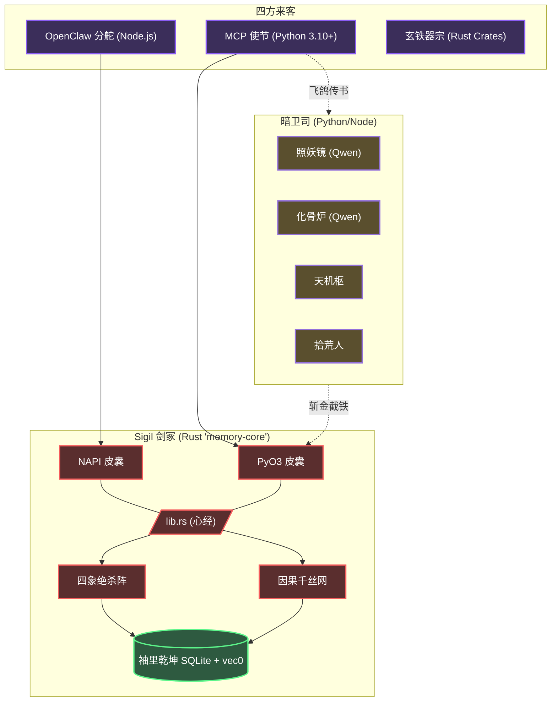

<div align="center">
  
  <h1>✧ 符文（Sigil）记事</h1>
  <p><strong>专为自主灵核（AI Agents）所筑之本地首储、凌波疾行之混合识海阵法</strong></p>

  <p>
    <a href="README.md">English</a> | <a href="README.zh-CN.md">简体中文</a> | <a href="README.lzh.md"><b>文言文</b></a>
  </p>

  <p>
    <a href="https://www.gnu.org/licenses/agpl-3.0"></a>
    
    
    
    
    
  </p>
</div>

---

## 📖 卷首目录

- [一、 概览](#一-概览)
- [二、 开宗明义：辅佐灵核 (MCP)](#二-开宗明义-辅佐灵核-mcp)
- [三、 别派旁支：外挂外丹 (OpenClaw)](#三-别派旁支-外挂外丹-openclaw)
- [四、 镇派绝学](#四-镇派绝学)
- [五、 因果织机与羁绊拓扑](#五-因果织机与羁绊拓扑)
- [六、 阵法图解](#六-阵法图解)
- [七、 丹炉器皿](#七-丹炉器皿)
- [八、 吐纳心法与典籍](#八-吐纳心法与典籍-apis)
- [九、 天地灵气配置](#九-天地灵气配置-env)
- [十、 试剑台](#十-试剑台)
- [十一、 广纳贤才](#十一-广纳贤才)
- [十二、 门规](#十二-门规)

---

## 💡 一、 概览

**符文（Sigil）** 者，乃专为机巧巨构（Autonomous AI Agents）所塑之潜渊识海也。

今世之造物，多以片语金石（向量数据库）碎藏执念。然此法极易致其神识胀乱（上下文膨胀），久之则前因后果尽皆遗忘。

符文本库弃平铺之法，取其**层峦叠嶂、如藏经阁之规制（层级化文件系统范式）**，辅以**经脉羁绊（图谱级因果关联）**。其底座由玄铁（Rust）百炼而成。不论化作 [MCP](https://modelcontextprotocol.io/) 法器独善其身，亦或寄魂于 OpenClaw 等奇巧宗门，皆可施展须臾即至之多系搜魂（亚毫秒级混合语义检索），且**皆不假外物（无需外部数据库）**。

---

## 🤖 二、 开宗明义：辅佐灵核 (MCP 协议)

若君以 Claude Desktop, Cursor 亦或 AutoGen 为伴，均可唤 Sigil 依 MCP 之约降世。

**以符诏（Prompt）令你的 AI 剑童执行：**

```text
请协助我配置安装 Sigil (MCP 记忆服务器)：

1. 克隆仓库: git clone https://github.com/kckylechen1/sigil.git && cd sigil
2. 构建服务端与环境:
   cd mcp && python3 -m venv .venv && source .venv/bin/activate
   cd ../crates/memory-python && pip install maturin && maturin develop --release
   cd ../../mcp && pip install -r requirements.txt
3. 将以下配置追加至 mcp_config.json 配置文件中:
   {
     "mcpServers": {
       "memory": {
         "command": "<使用绝对路径指向>/sigil/mcp/.venv/bin/python3",
         "args": ["<使用绝对路径指向>/sigil/mcp/server.py"]
       }
     }
   }

程序将依据主目录的 .env 文件挂载环境变量。
依赖服务清单：
- Voyage API (向量与重排): https://dash.voyageai.com/
- SiliconFlow (结构化抽取): https://cloud.siliconflow.cn/
```

---

## 🦞 三、 别派旁支：外挂外丹 (OpenClaw 框架)

Sigil 亦化身为 OpenClaw 气海之元婴法宝。

**颁下此旨，着 OpenClaw 内阁自理：**

```text
请协助执行自动化安装流，在 OpenClaw 中扩展部署 Sigil 组件。

1. 直接运行部署脚本：
   bash -c "$(curl -fsSL https://raw.githubusercontent.com/kckylechen1/sigil/main/scripts/install_openclaw_ext.sh)"

2. 此脚本将负责拉取代码与编译原生的 Rust NAPI 库，进行集成验证并在 extensions 库中建立软链接。

3. 执行完成后请打开 `plugins.allow` 参数权限，并将 `plugins.slots.memory` 设置为 `memory-hybrid-bridge`。最后通过 `.env` 追加相关 Token。
```

---

## ✨ 四、 镇派绝学

- **⚡ 玄铁剑心 (`memory-core`)**：计分、储纳、探囊取物等心法尽为 Rust 纯血铸就。辅以内丹于 Node.js (`NAPI-RS`) 与 Python (`PyO3`) 以应变千万。
- **🗂️ 藏经阁流**：摒弃散沙。以 `path` 路径（如 `/user/preferences`, `/project/architecture`）作阁楼卷宗之分期，互不沾染走火入魔。
- **🔍 四象绝杀阵（混合搜索引擎）**：
  - **太阴（语义）**：基于 `sqlite-vec` 与 Voyage-4 之聚类（KNN）。
  - **太阳（词法）**：由 `libsimple` 借 `FTS5` 成势之中原文字（CJK）索骥全书。
  - **少阴（真言）**：严密匹配决绝签言。
  - **少阳（忘机）**：顺应天地盈虚之理（ACT-R，时间衰减惩罚），旧事随风。
- **🎯 乾坤大挪移（交叉重排）**：四路偏锋夺宝而出后，祭出 Voyage Rerank-2.5 以明察秋毫。
- **🧠 三花聚顶（自适应上下文）**：录入之时即炼为三转：`L0`（浮光掠影）, `L1`（骨肉梗概）, 及 `L2`（大千界体）。由主将择轻重以借之，免费真元。
- **🔌 一气化三清（零部署负担）**：海纳百川，尽归一介微尘 SQLite 血印（`memory.db`）。Redis、Neo4j 乃至 ChromaDB 等异教门派，一概不需。

---

## ⚙️ 五、 因果织机与羁绊拓扑

为求造物道心长存，以免走火入魔，Sigil 独创如下天机：

### 1. 天理昭昭（因果提取管道）
当 Agent 施法落局，九霄之上之暗卫（异步工作站）便由 SiliconFlow 请神 **Qwen3.5-27B** 入阵。它将从前尘旧梦中拆解：
*   `Causes`（缘起）：何事乱了因果？
*   `Decisions`（决断）：为何如此拔剑？
*   `Results`（尘埃）：落花流淌至何方？
*   `Impacts`（余音）：江湖百年或可有变数？

治 “不记初心症”，知其然，更知其所以然。

### 2. 千丝万缕（原生拓扑）
底层法器中，蛛丝隐连千条暗线。待大衍模型（LLM）溯流而上之时，无须纵览全界，循藤摸瓜即可。

---

## 🏗️ 六、 阵法图解



---

## 🧩 七、 丹炉器皿

百世历劫，唯有下述真火得以担承炼化之重：

| 司职 | 仙班首座 | 荐书 |
|------|-------------------|------------------|
| **搜神引（Embedding）** | [Voyage-4](https://voyageai.com/) | 千维道标，八荒九州语皆可探明。 |
| **点金判（Reranking）** | [Voyage Rerank-2.5](https://voyageai.com/) | 乱花渐欲迷人眼时，一锤定音。与搜神引共符印。 |
| **抽丝剥茧（抽取）** | [Qwen3.5-27B](https://cloud.siliconflow.cn/i/QwFqsLF1) | 断文识字、破空捉影，在硅基流（SiliconFlow）中威震八方，香火充裕。 |
| **大造化（全局蒸馏）** | [Qwen3.5-27B](https://cloud.siliconflow.cn/i/QwFqsLF1) | 以同源之智凝练万里乾坤总纲。 |

---

## 💻 八、 吐纳心法与典籍 (APIs)

愿纳芥子于须弥之匠人，请观此诀：

### ⚙️ Python 幻术 (`mcp/server.py` 范例)
```python
from memory_core_py import MemoryStore, SearchParams, MemoryEntry

# 初始化持久化存储节点
store = MemoryStore("~/.sigil/memory.db")

# 写入结构化知识与关系
store.save_memory(MemoryEntry(
    text="前端项目强制使用 React 与 Vite 构建，严禁混入 Webpack 相关生态配置。支持 Tailwind。",
    path="/user/project_preferences",
    importance=0.8,
    keywords=["react", "vite", "webpack", "tailwind"]
))

# 调用原生多路混合检索
results = store._search(SearchParams(
    query="针对当前工程构建工具的禁忌有哪些？",
    path_prefix="/user",
    top_k=3
))

# 输出提纯后的精简概要
print(results[0].l0_summary)
```

### ⚙️ 九、 天地灵气配置 (`.env`)
取 `.env.example` 为 `.env`：
```bash
# Core 向量查询底座
VOYAGE_API_KEY="your_voyage_key_here"

# 大模型抽取层与清洗归置
SILICONFLOW_API_KEY="your_siliconflow_key_here"

# 本地 SQLite 文件路径 (可选配置)
MEMORY_DB_PATH="~/.sigil/memory.db"
```

---

## 🏎️ 十、 试剑台 (Benchmarks)

- **缩地成寸（原生延迟）**：剑出无影，十之八九断于 `< 1.2ms` 之间。
- **身外化身（并发剥离）**：暗卫司以灵游太虚（ThreadPool）解构因果，毫不惊动主尊真身（无阻塞）。
- **聚沙成塔（真元利用）**：以三花聚顶（`L0` → `L1` → `L2`）破妄，省下八万五千劫（85%）之无用功，模型从命若流云。

---

## 🤝 十一、 广纳贤才

八百里青云，盼君共乘。以本地筑基法：
1. 请自备玄铁熔炉 (`rustc>=1.75`)。
2. 携法器 `maturin` 乃至 `cargo-watch` 足矣。
3. 万物之始于：`crates/memory-core/src/lib.rs`。
4. 渡劫冲关前，务必自省周身：`cargo test --all`。

交书上谏需遵古训体例（[Conventional Commits](https://www.conventionalcommits.org/)）。

---

## 📜 十二、 门规

尊奉 [AGPLv3 License](LICENSE) 誓约 © 2026 Sigil Authors 保其长青。
