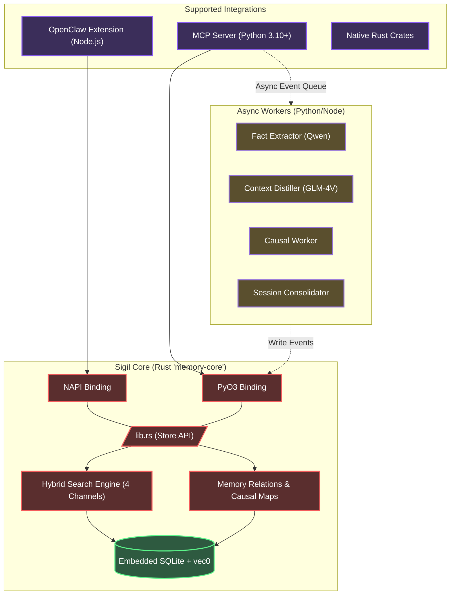

<div align="center">
  
  <h1>✧ Sigil Memory System</h1>
  <p><strong>A Local-First, High-Performance Hybrid Context Database Built Specifically for Autonomous AI Agents</strong></p>

  <p>
    <a href="README.md"><b>English</b></a> | <a href="README.zh-CN.md">简体中文</a>
  </p>

  <p>
    <a href="https://www.gnu.org/licenses/agpl-3.0"></a>
    
    
    
    
    
  </p>
</div>

---

## 📖 Table of Contents

- [Overview](#-overview)
- [Key Features](#-key-features)
- [The Causal Worker Pipeline & Memory Relations](#-the-causal-worker-pipeline--memory-relations)
- [Architecture](#-architecture)
- [Model Stack](#-model-stack)
- [Quick Start: For AI Coding Agents](#-quick-start-for-ai-coding-agents)
- [Quick Start: For Frameworks (OpenClaw)](#-quick-start-for-frameworks-openclaw)
- [Manual Installation & APIs](#-manual-installation--apis)
- [Environment Configuration](#-environment-configuration)
- [Benchmarks](#-benchmarks)
- [Contributing](#-contributing)
- [License](#-license)

---

## 💡 Overview

**Sigil** (from Latin *sigillum*, meaning "magic seal" or "symbol") is an embedded, unified context and memory management system designed precisely for Autonomous AI Agents. 

Current memory models for AI Agents rely on fragile, flat lists of text snippets injected directly into prompts via simple vector databases. This quickly deteriorates agent performance due to overwhelming context sizes and out-of-order narratives. 

Sigil abandons flat structures in favor of a **hierarchical, file-system-like paradigm** and **graph-based causal relations** backed by heavily optimized Rust code. Whether you are building a standard [Model Context Protocol (MCP)](https://modelcontextprotocol.io/) server or extending native frameworks like OpenClaw, Sigil provides sub-millisecond, multi-modal semantic retrieval with **zero external database dependencies**.

---

## ✨ Key Features

- **⚡ Blazing Fast Rust Core (`memory-core`)**: The entire scoring, storage, entity extraction, and retrieval engine is written in Rust, wrapped dynamically for Node.js (`NAPI-RS`) and Python (`PyO3`).
- **🗂️ Filesystem Paradigm**: Context is not a flat list. Memories are organized hierarchically by `path` (e.g., `/user/preferences`, `/project/architecture`).
- **🔍 4-Channel Hybrid Search**:
  - **Semantic**: Built-in Voyage-4 vector embedding search (`sqlite-vec` KNN).
  - **Lexical**: Native CJK full-text search (`libsimple` + `FTS5`).
  - **Symbolic**: Exact keyword and categorical entity matching.
  - **Decay**: ACT-R cognitive architecture-inspired recency decay.
- **🎯 Precision Reranking**: Utilizes the highly-cited Voyage Rerank-2.5 on top of hybrid candidates to boost hit rate.
- **🧠 3-Tier Context Loading**: Auto-extracts `L0` (Abstract Sentence), `L1` (Overview Paragraph), and `L2` (Full Text) to save tokens. Agents retrieve exactly horizontal or vertical context depth based on urgency.
- **🔌 Zero Ops Embedded System**: Packaged as a single SQLite file (`memory.db`), completely embedded. No Redis, no Neo4j, no ChromaDB required. Your agent runs anywhere.

---

## ⚙️ The Causal Worker Pipeline & Memory Relations

As of version `0.2.0`, Sigil introduces profound reasoning components usually found only in enterprise graph databases:

### 1. The Causal Extraction Pipeline
When an agent dumps massive interaction logs into Sigil, the async Causal Worker automatically awakens. Using **Qwen3.5-27B** via SiliconFlow, it deeply analyzes the agent's turn to extract:
*   `Causes`: The events that triggered the agent's actions.
*   `Decisions`: The reasoning pathway applied by the agent.
*   `Results`: The hard outcomes.
*   `Impacts`: Long-term effects on the workspace or system.

This prevents the pervasive "Agent Amnesia" where agents remember *what* they did, but forget *why* they did it.

### 2. Native Memory Relations
Sigil's storage layer implicitly links connected entities, facts, and causal interactions into a native graph, allowing your LLM to traverse dependencies without jumping straight down the context-window cliff.

---

## 🏗️ Architecture



---

## 🧩 Model Stack

We have tested countless models to find the perfect tradeoff between latency, quality, and cost for the internal workers:

| Role | Recommended Model | Why this choice? |
|------|-------------------|------------------|
| **Embedding** | [Voyage-4](https://voyageai.com/) | 1024d vectors, top-tier multilingual retrieval. **200M free tokens** on signup. |
| **Reranking** | [Voyage Rerank-2.5](https://voyageai.com/) | Cross-encoder precision boost after hybrid recall. Same API key as embedding. |
| **Fact/Causal Extraction** | [Qwen3.5-27B](https://cloud.siliconflow.cn/) (SiliconFlow) | Phenomenal accuracy for structured JSON parsing and causal reasoning. Generous free tier. |
| **Summarization** | GLM-4V-Flash | Ultra-fast L0 one-sentence abstract generation. |

---

## 🤖 Quick Start: For AI Coding Agents 

If you use Claude Desktop, Cursor, or AutoGen, Sigil works out-of-the-box as an MCP memory server. **Copy the block below and paste it directly to your Assistant**:

```text
Help me set up Sigil — a local-first memory system for AI agents.

1. Clone: git clone https://github.com/kckylechen1/sigil.git && cd sigil
2. Setup MCP server:
   cd mcp && python3 -m venv .venv && source .venv/bin/activate
   cd ../crates/memory-python && pip install maturin && maturin develop --release
   cd ../../mcp && pip install -r requirements.txt
3. Add to my mcp_config.json:
   {
     "mcpServers": {
       "memory": {
         "command": "<absolute-path-to>/sigil/mcp/.venv/bin/python3",
         "args": ["<absolute-path-to>/sigil/mcp/server.py"]
       }
     }
   }

The server auto-loads API keys from the root `.env` file — no need to pass them in mcp_config.
If I don't have API keys yet, help me register (both have massive free tiers, no credit card needed!):
- Voyage API (embedding + rerank): https://dash.voyageai.com/
- SiliconFlow (fact extraction): https://cloud.siliconflow.cn/
```

---

## 🦞 Quick Start: For Frameworks (OpenClaw)

Sigil can run as a native OpenClaw extension plugin. **Copy the block below and paste it to your OpenClaw IDE Assistant:**

```text
Help me install Sigil as an OpenClaw memory extension using the one-click script.

1. Run the auto-installer:
   bash -c "$(curl -fsSL https://raw.githubusercontent.com/kckylechen1/sigil/main/scripts/install_openclaw_ext.sh)"

2. The script will clone or update the repository, build the Rust NAPI module, compile the OpenClaw plugin, run a load smoke test, and symlink it into your OpenClaw extensions directory.

3. After the script finishes, enable `memory-hybrid-bridge` in `plugins.allow`, point `plugins.slots.memory` to `memory-hybrid-bridge`, and fill in API keys in `.env` if they are not already exported.
```

---

## 💻 Manual Installation & APIs

If you are a developer looking to integrate `memory-core` into your custom Python or Node script directly:

### ⚙️ Python Environment (`mcp/server.py`)
```python
from memory_core_py import MemoryStore, SearchParams, MemoryEntry

# Database auto-initializes
store = MemoryStore("~/.sigil/memory.db")

# Save a deeply structured memory
store.save_memory(MemoryEntry(
    text="The user prefers React frontend with Vite, absolutely no Webpack. Tailwind is allowed.",
    path="/user/project_preferences",
    importance=0.8,
    keywords=["react", "vite", "webpack", "tailwind"]
))

# Retrieve via full 4-channel Hybrid Search
results = store._search(SearchParams(
    query="What is the preferred bundler?",
    path_prefix="/user",
    top_k=3
))
print(results[0].l0_summary) # Lightning-fast L0 retrieval
```

### ⚙️ Environment Configuration (`.env`)
Sigil utilizes a unified environment system. Copy `.env.example` to `.env` in the root folder.
```bash
# Core Embedding and Retrieval
VOYAGE_API_KEY="your_voyage_key_here"

# LLM Extractor & Distiller (e.g. Qwen3.5-27B)
SILICONFLOW_API_KEY="your_siliconflow_key_here"

# (Optional) Customize path
MEMORY_DB_PATH="~/.sigil/memory.db"
```

---

## 🏎️ Benchmarks

- **End-to-end P95 Latency (Rust)**: `< 1.2ms` (for purely native hybrid lookups).
- **Extraction Parallelism**: Background Python ThreadPool handles Qwen extraction with zero UI/Main-loop blocking.
- **Token Efficiency**: Sigil's hierarchical `L0` → `L1` → `L2` generation reduces retrieval payload context-bloat by up to **85%** compared to naive RAG text fetching chunks, drastically improving agent instruction following.

---

## 🤝 Contributing

We welcome contributions! To set up Sigil locally for development:
1. Ensure you have Rust `rustc>=1.75` installed.
2. Install `maturin` and `cargo-watch`.
3. Read the `crates/memory-core/src/lib.rs` for the main DB layout.
4. Ensure `cargo test --all` passes before submitting pull requests.

Please format your commit messages following [Conventional Commits](https://www.conventionalcommits.org/).

---

## 📜 License

[AGPLv3 License](LICENSE) © 2026 Sigil Authors.
