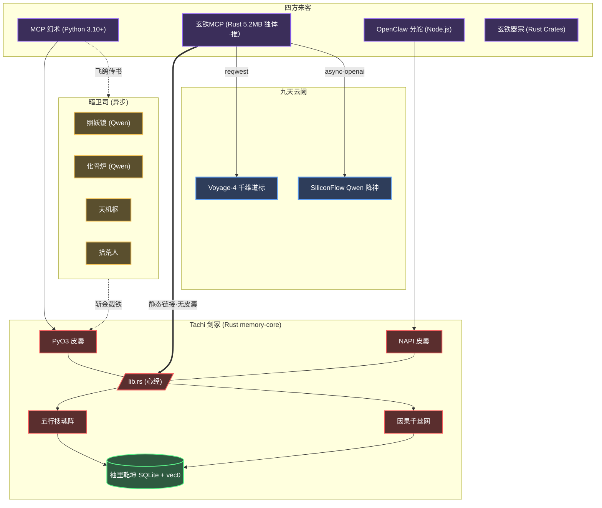

<div align="center">
  
  <h1>✧ 藏经阁（Tachi）记事</h1>
  <p><strong>专为自主灵核（AI Agents）所筑之本地首储、凌波疾行之混合识海阵法</strong></p>

  <p>
    <a href="README.en.md">English</a> | <a href="README.zh-CN.md">简体中文</a> | <a href="README.md"><b>文言文</b></a>
  </p>

  <p>
    <a href="https://www.gnu.org/licenses/agpl-3.0"></a>
    
    
    
    
    
  </p>
</div>

---

## 📖 卷首目录

- [一、 概览](#一-概览)
- [二、 立派初心](#二-立派初心)
- [三、 开宗明义：辅佐灵核 (MCP)](#三-开宗明义-辅佐灵核-mcp)
- [四、 别派旁支：外挂外丹 (OpenClaw)](#四-别派旁支-外挂外丹-openclaw)
- [五、 镇派绝学](#五-镇派绝学)
- [六、 因果织机与羁绊拓扑](#六-因果织机与羁绊拓扑)
- [七、 阵法图解](#七-阵法图解)
- [八、 丹炉器皿](#八-丹炉器皿)
- [九、 吐纳心法与典籍](#九-吐纳心法与典籍-apis)
- [十、 天地灵气配置](#十-天地灵气配置-env)
- [十一、 试剑台](#十一-试剑台)
- [十二、 广纳贤才](#十二-广纳贤才)
- [十三、 门规](#十三-门规)

---

## 💡 一、 概览

**藏经阁（Tachi）** 者，乃专为机巧巨构（Autonomous AI Agents）所塑之潜渊识海也。其名取自《攻壳机动队》之藏经阁科马——以共享记忆进化出灵识之机巧战车。

今世之造物，多以片语金石（向量数据库）碎藏执念。然此法极易致其神识胀乱（上下文膨胀），久之则前因后果尽皆遗忘。

**藏经阁** 弃平铺之法，取其**层峦叠嶂、如藏经阁之规制（层级化文件系统范式）**，辅以**经脉羁绊（图谱级因果关联）**。其底座由玄铁（Rust）百炼而成。不论化作 [MCP](https://modelcontextprotocol.io/) 法器独善其身，亦或寄魂于 OpenClaw 等奇巧宗门，皆可施展须臾即至之多系搜魂（亚毫秒级混合语义检索），且**皆不假外物（无需外部数据库）**。

---

## 🎯 二、 立派初心

### 1. 破虚妄与遗忘（除上下之胀）
寻常造物多赖无根之木（平铺向量），岁久则记忆散乱，神识胀缩且常丢因果。藏经阁辟阁楼之制（层级路径）、炼三转内丹（自适应抽取），并辅以因果缘线（Graph Edges），将闲篇散语化作脉络分明之“数字灵海”。

### 2. 归真与守缺（极速与主权）
历劫感悟乃灵核机密，岂可付诸云端外邦。藏经阁不假外求，纯以玄铁（Rust）打底，纳太阴太阳于一体，双库隔离（大千与宗门）。起承转合间，雷霆检索不过毫厘（亚毫秒）。

### 3. 平息灵枢之乱（终结 MCP 乱象）
若多派剑童（多 Agent 并发）各自起阵招魂（spawn 子进程），必致天地元气枯竭、游魂遍野（僵尸进程）。万宝楼（Tachi Hub）兼任天地大阵，一处收录，八方共享。连接共饮一江水，闲时自散，危时自保（熔断），清洗污秽（保留核心环境变量），免除同室操戈之扰。

### 4. 轮回生灭之洁癖（记忆生命周期）
求长生者，必防业障生恶（幻觉劣化）。藏经阁不吝手段，设守门金刚（入库拦截废料 `is_noise_text`）、遣暗卫时时扫尘（后台 GC），乃至挫骨扬灰之刑（`delete_memory` 级联粉碎）。此等严苛宗法，方保百年运转无一丝尘埃。

---

## 🤖 三、 开宗明义：辅佐灵核 (MCP 协议)

若君以 Claude Desktop, Cursor 亦或 AutoGen 为伴，均可唤 Tachi 依 MCP 之约降世。

**以符诏（Prompt）令你的 AI 剑童执行：**

```text
请协助我配置安装 Tachi (MCP 记忆服务器)：

1. 克隆仓库: git clone https://github.com/kckylechen1/tachi.git && cd Tachi

【方式一】幻术启灵（Python 运行时）：
   cd mcp && python3 -m venv .venv && source .venv/bin/activate
   cd ../crates/memory-python && pip install maturin && maturin develop --release
   cd ../../mcp && pip install -r requirements.txt
   配置 mcp_config.json:
   {
     "mcpServers": {
       "memory": {
         "command": "<绝对路径>/Tachi/mcp/.venv/bin/python3",
         "args": ["<绝对路径>/Tachi/mcp/server.py"]
       }
     }
   }

【方式二】玄铁炼体（Rust 原生启·最速·推荐）：
   brew tap kckylechen1/tachi && brew install tachi
   配置 mcp_config.json:
   {
     "mcpServers": {
       "tachi": {
         "command": "tachi",
         "env": {
           "VOYAGE_API_KEY": "...",
           "SILICONFLOW_API_KEY": "..."
         }
       }
     }
   }

程序将依据主目录的 .env 文件挂载环境变量。
依赖服务清单：
- Voyage API (向量与重排): https://dash.voyageai.com/
- SiliconFlow (结构化抽取): https://cloud.siliconflow.cn/
```

---

## 🦞 四、 别派旁支：外挂外丹 (OpenClaw 框架)

Tachi 亦化身为 OpenClaw 气海之元婴法宝。

**颁下此旨，着 OpenClaw 内阁自理：**

```text
请协助执行自动化安装流，在 OpenClaw 中扩展部署 Tachi 组件。

1. 直接运行部署脚本：
   bash -c "$(curl -fsSL https://raw.githubusercontent.com/kckylechen1/tachi/main/scripts/install_openclaw_ext.sh)"

2. 此脚本将负责拉取代码与编译原生的 Rust NAPI 库，进行集成验证并在 extensions 库中建立软链接。

3. 执行完成后请打开 `plugins.allow` 参数权限，并将 `plugins.slots.memory` 设置为 `memory-hybrid-bridge`。最后通过 `.env` 追加相关 Token。
```

---

## ✨ 五、 镇派绝学

- **⚡ 玄铁剑心 (`memory-core`)**：计分、储纳、探囊取物等心法尽为 Rust 纯血铸就。辅以内丹于 Node.js (`NAPI-RS`) 与 Python (`PyO3`) 以应变千万。自 v0.8 、已有**三十四法器** (34 MCP tools) 始得面世。
- **🗂️ 藏经阁流**：摒弃散沙。以 `path` 路径（如 `/user/preferences`, `/project/architecture`）作阁楼卷宗之分期，互不沾染走火入魔。
- **🔍 三分天下（多系搜魂）**：
  - **太阴（语义）**：以 `sqlite-vec` 携 Voyage-4 直嵌玄冥。
  - **太阳（词法）**：由 `libsimple` 借 `FTS5` 成势之中原文字（CJK）索骥全书。
  - **少阳（忘机）**：顺应天地盈虚之理（ACT-R），旧事随风，光阴荏苒。
- **🔒 千金一诺（金石铁律）**：辟 `hard_state` 幽地以藏刚性卷宗，如兵甲仓储，点滴不漏，绝无虚妄（幻觉）之忧。
- **🧠 三花聚顶（自适应上下文）**：录入之时即炼为三转：`L0`（浮光掠影）, `L1`（骨肉梗概）, 及 `L2`（大千界体）。由主将择轻重以借之，免费真元。
- **🔄 两阶演化（记忆去重）**：首创 `HARD_SKIP` 与 `EVOLVE` 双阶去尘，以算数（数学相似度）为矩，免去过妄之弊。
- **🔌 两界分治（双库阵法）**：天外之识存于全局藏经阁 (`~/.Tachi/global/memory.db`)，门内之学纳于各宗项目密库 (`.Tachi/memory.db`)。以 git 根脉自动辨识，且可将旧阁无痕迁徙。外物数据库概所不需。
- **🎯 万宝楼（Tachi Hub）**：天下法器、仙诀、灵枢尽纳此中。只需登录一次，各路灵核均可按图索骥。内设功行考核、投名评鉴、双库传承（宗门可覆天下通制）。现存六十七部入门仙诀，开箱即用。
- **🔀 灵枢转运（MCP 代理）**：只需于万宝楼登入一次子灵枢，诸般法器便可为天下灵核透明调度。共享灵脉连接，闲时自断，熔断护体，并发可控。派发灵气时保殄二十一根系统命脉，输送符箓三别名 (`http`、`streamable-http` 皆可通 `sse`)。僵尸进程，就此绝迹。
- **🗑️ 轮回生灭（记忆生命周期）**：`delete_memory` 可将一段尘缘彻底贫灭，关联遗孤尽皆归尘；`archive_memory` 可封印封存，他日可解；`memory_gc` 可清扫陈年旧事、发霉记录。
- **🧹 搭脉过滤（降噪）**：录入时静观材料，若为废料则送客，不开炉炼丹 (`is_noise_text`)；检索时先审问口诀，若为废话则不取经文 (`should_skip_query`)。节省灵石（Embedding API），保藏经阁清明。确需强录者，置 `force=true` 可破例。
- **⏰ 自动扫尘（后台垃圾回收）**：每隔六个时辰，暗卫司自行巡视各大卯册，将过期日志、陈年旧事清却。可置 `MEMORY_GC_INTERVAL_SECS` 调节时辰，完全无需掌师亲临。
- **🕸️ 因果网结（图谱操作）**：可用 `add_edge` 新结因果缘线，以 `get_edges` 查探千丝网络。支持因果、时序、实体三种羁绊，各带元数据与权重。
- **🔗 缘线自织（自动链接）**：`save_memory` 每录新识，便自行侦查天下哪家与之共享同一实体，暗中编织因果线（异步无阻）。默认开启，置 `auto_link=false` 可禁。

---

## ⚙️ 六、 因果织机与羁绊拓扑

为求造物道心长存，以免走火入魔，Tachi 独创如下天机（注：现为求极致雷霆之速，此法阵**默认蛰伏**，须设 `ENABLE_PIPELINE=true` 方可唤醒）：

### 1. 天理昭昭（因果提取管道）
当 Agent 施法落局，九霄之上之暗卫（异步工作站）便由 SiliconFlow 请神 **Qwen3.5-27B** 入阵。它将从前尘旧梦中拆解：
*   `Causes`（缘起）：何事乱了因果？
*   `Decisions`（决断）：为何如此拔剑？
*   `Results`（尘埃）：落花流淌至何方？
*   `Impacts`（余音）：江湖百年或可有变数？

治 “不记初心症”，知其然，更知其所以然。

### 2. 万法归宗（幽明两隔）
凡藉由天理推演之果，与化骨炉所炼之箴言，皆被打入无还境（`derived_items` 表），与承载真实凡尘之太虚真界（`memories` 真相表）绝无瓜葛。藉此以保真源不被虚妄之念（AI 幻觉）所染。

---

## 🏗️ 七、 阵法图解



---

## 🧩 八、 丹炉器皿

百世历劫，唯有下述真火得以担承炼化之重：

| 司职 | 仙班首座 | 荐书 |
|------|-------------------|------------------|
| **搜神引（Embedding）** | [Voyage-4](https://voyageai.com/) | 千维道标，八荒九州语皆可探明。与玄铁丹心（Rust 核心）直接交汇。 |
| **抽丝剥茧（抽取）** | [Qwen3.5-27B](https://cloud.siliconflow.cn/i/QwFqsLF1) | 断文识字、破空捉影。（惟于 `ENABLE_PIPELINE=true` 方遣将其降世）|
| **大造化（全局蒸馏）** | [Qwen3.5-27B](https://cloud.siliconflow.cn/i/QwFqsLF1) | 以同源之智凝练万里乾坤总纲。（同上） |
| **异步法器（Rust）** | [`async-openai`](https://github.com/64bit/async-openai) + [`reqwest`](https://docs.rs/reqwest/) | 玄铁MCP之内丹，直通云端法力，异步吞吐，不滞于物。 |

---

## 💻 九、 吐纳心法与典籍 (APIs)

愿纳芥子于须弥之匠人，请观此诀：

### ⚙️ Python 幻术 (`mcp/server.py` 范例)
```python
from mcp.server.stdio import stdio_server
# ... (通过 MCP 客户端通信的主入口)

# 1. 写入结构化软记忆 (Vector + FTS + Time-衰减，异步摘要)
save_memory(
    text="前端项目强制使用 React 与 Vite 构建，严禁混入 Webpack 相关生态配置。支持 Tailwind。",
    path="/user/project_preferences",
    importance=0.8,
    keywords=["react", "vite", "webpack", "tailwind"]
)

# 2. 调用原生多路混合检索
results = search_memory(
    query="针对当前工程构建工具的禁忌有哪些？",
    path_prefix="/user",
    top_k=3
)

# 3. 强一致性硬状态存储 (0 向量感知，极简 KV 持久化)
set_state(
    namespace="trading",
    key="watchlist",
    value={"600089": "TBEA", "688256": "Cambricon"}
)
```

### ⚙️ 十、 天地灵气配置 (`.env`)
取 `.env.example` 为 `.env`：
```bash
# Core 向量查询底座
VOYAGE_API_KEY="your_voyage_key_here"

# 大模型抽取层与清洗归置
SILICONFLOW_API_KEY="your_siliconflow_key_here"

# 本地 SQLite 文件路径 (可选·默认自动解析为 ~/.Tachi/global/memory.db + 项目 .Tachi/memory.db)
MEMORY_DB_PATH="~/.Tachi/global/memory.db"
```

---

## 🏎️ 十一、 试剑台 (Benchmarks)

- **缩地成寸（原生延迟）**：剑出无影，十之八九断于 `< 1.2ms` 之间。
- **身外化身（并发剥离）**：暗卫司以灵游太虚（ThreadPool）解构因果，毫不惊动主尊真身（无阻塞）。
- **聚沙成塔（真元利用）**：以三花聚顶（`L0` → `L1` → `L2`）破妄，省下八万五千劫（85%）之无用功，模型从命若流云。

---

## 🤝 十二、 广纳贤才

八百里青云，盼君共乘。以本地筑基法：
1. 请自备玄铁熔炉 (`rustc>=1.75`)。
2. 携法器 `maturin` 乃至 `cargo-watch` 足矣。
3. 万物之始于：`crates/memory-core/src/lib.rs`。
4. 渡劫冲关前，务必自省周身：`cargo test --all`。

交书上谏需遵古训体例（[Conventional Commits](https://www.conventionalcommits.org/)）。

---

## 📜 十三、 门规

尊奉 [AGPLv3 License](LICENSE) 誓约 © 2026 Tachi Authors 保其长青。
