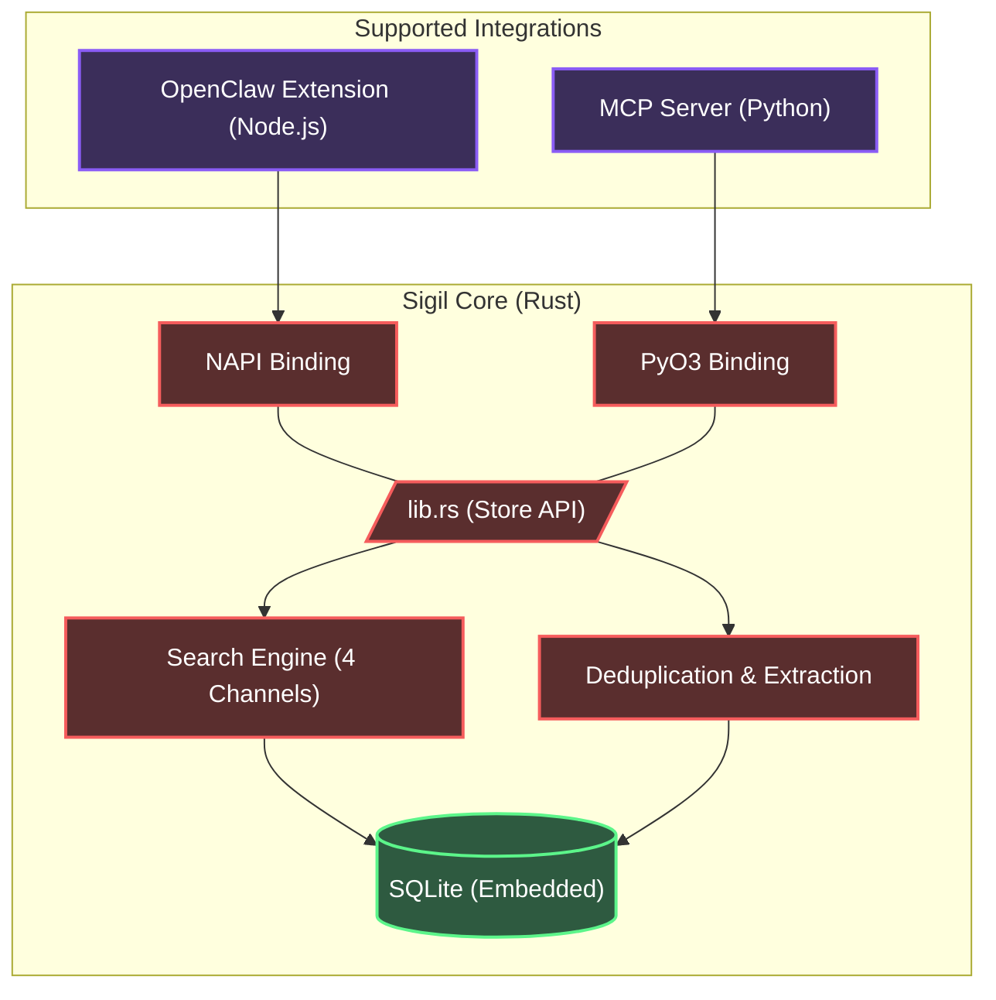

<div align="center">
  <h1>✧ Sigil</h1>
  <p><strong>A Local-First, High-Performance Hybrid Context Database for AI Agents</strong></p>

  <div align="center">
    
  </div>

  <p>
    <a href="README.md">English</a> | <a href="README.zh-CN.md">简体中文</a>
  </p>

  <p>
    <a href="https://opensource.org/licenses/MIT"></a>
    
    
    
  </p>
</div>

---

## 🏃 快速运行记忆提取评测

```bash
# 进入评测脚本目录
cd /Users/kckylechen/Desktop/Sigil/integrations/openclaw

# 确保 SILICONFLOW_API_KEY 已设置
export SILICONFLOW_API_KEY='你的API密钥'

# 运行评测 (对比 Qwen3-8B vs GLM-4-9B)
npx tsx benchmark_extraction.ts

# 评测结果将保存到: benchmark_extraction_result.json
```

---

**Sigil** is an embedded, unified context and memory management system designed specifically for AI Agents. It abandons flaky, flat memory structures in favor of a **hierarchical, file-system-like paradigm** backed by highly optimized Rust code. 

Whether you are building a Model Context Protocol (MCP) server or extending an agent framework like OpenClaw, Sigil provides sub-millisecond, multi-modal semantic retrieval with zero external database dependencies.

## ✨ Features

- **⚡ Blazing Fast Rust Core**: The entire scoring, storage, and retrieval engine is written in Rust, wrapped dynamically for Node.js (`NAPI-RS`) and Python (`PyO3`).
- **🗂️ Filesystem Paradigm**: Context is not a flat list. Memories are organized hierarchically by `path` (e.g., `/user/preferences`, `/project/architecture`).
- **🔍 4-Channel Hybrid Search**:
  - **Semantic**: Built-in Voyage-4 vector embedding search (`sqlite-vec` KNN).
  - **Lexical**: Native CJK full-text search (`libsimple` + `FTS5`).
  - **Symbolic**: Exact keyword and entity matching.
  - **Decay**: ACT-R cognitive architecture-inspired recency decay.
  - **Precision Reranking**: Voyage Rerank-2.5 on top of hybrid candidates.
- **🧠 Advanced Entity Extraction**: Extracts memories into strictly typed categories (`preference`, `decision`, `entity`, `fact`, `other`) for rigorous schema validation.
- **🧠 3-Tier Context Loading**: Auto-extracts `L0` (Abstract), `L1` (Overview), and `L2` (Full Text) to save tokens.
- **🔌 Zero Ops**: Packaged as a single SQLite file (`memory.db`), completely embedded. No Redis, no Neo4j, no ChromaDB required.

### 🧩 Model Stack

| Role | Model | Why |
|------|-------|-----|
| **Embedding** | [Voyage-4](https://voyageai.com/) | 1024d vectors, top-tier multilingual retrieval. **200M free tokens** on signup. |
| **Reranking** | [Voyage Rerank-2.5](https://voyageai.com/) | Cross-encoder precision boost after hybrid recall. Same API key as embedding. |
| **Extraction** | [GLM-4-9B](https://cloud.siliconflow.cn/) via SiliconFlow | Fastest + most accurate for structured fact extraction (tested against Qwen3-8B, Llama, etc.). Free tier. |
| **Summarization** | GLM-4V-Flash | Ultra-fast L0 one-sentence abstract generation. |

---

## 🏗️ Architecture



---

## 🚀 Quick Start

### 🤖 For Coding Agents (Claude / Cursor / Antigravity)

> **Copy this to your AI coding agent to set up Sigil as an MCP memory server:**

```
Help me set up Sigil — a local-first memory system for AI agents.

1. Clone: git clone https://github.com/kckylechen1/sigil.git && cd sigil
2. Configure API keys: cp .env.example .env, then fill in my keys.
3. Setup MCP server:
   cd mcp && python3 -m venv .venv && source .venv/bin/activate
   cd ../crates/memory-python && pip install maturin && maturin develop --release
   cd ../../mcp && pip install -r requirements.txt
4. Add to my mcp_config.json:
   {
     "mcpServers": {
       "memory": {
         "command": "<absolute-path-to>/sigil/mcp/.venv/bin/python3",
         "args": ["<absolute-path-to>/sigil/mcp/server.py"]
       }
     }
   }

The server auto-loads API keys from the .env file — no need to pass them in mcp_config.

If I don't have API keys yet, help me register:
- Voyage API (embedding + rerank): https://dash.voyageai.com/ — 200M free tokens, no credit card
- SiliconFlow (fact extraction): https://cloud.siliconflow.cn/ — free tier available
```

### 🦞 For OpenClaw

> **Copy this to your OpenClaw agent to install Sigil as a native memory extension:**

```
Help me install Sigil as an OpenClaw memory extension using the one-click script.

1. Run the auto-installer:
   bash -c "$(curl -fsSL https://raw.githubusercontent.com/kckylechen1/sigil/main/scripts/install_openclaw_ext.sh)"

2. The script will set up the repository, build the NAPI-RS bindings, symlink to your OpenClaw plugins, and optionally configure your API keys.

If I don't have API keys yet, help me register:
- Voyage API (embedding + rerank): https://dash.voyageai.com/ — 200M free tokens, no credit card
- SiliconFlow (fact extraction): https://cloud.siliconflow.cn/ — free tier available
```

---

### Manual Setup

First, clone the repository and configure your environment details:

```bash
git clone https://github.com/kckylechen1/sigil.git
cd sigil
cp .env.example .env
```

Ensure you populate `.env` with the necessary API keys:
- **Voyage API** (`VOYAGE_API_KEY`): Used for embedding and reranking. [Register here](https://dash.voyageai.com/) to get **200 Million free tokens**.
- **Extraction API** (`SILICONFLOW_API_KEY`): Used for fact extraction and summarization. After extensive internal benchmarking, we strongly recommend using **GLM-4** (e.g., `THUDM/glm-4-9b-chat` via SiliconFlow) as it has proven to be the fastest and most accurate model for structuring memory facts.

### Option A: Running as an MCP Server (Python)

Sigil comes with a production-ready Model Context Protocol (MCP) server, perfect for Claude Desktop, Cursor, or AutoGen.

1. **Install uv / maturin** (if you haven't already):
   ```bash
   pip install uv maturin
   ```
2. **Setup virtual environment and compile Rust bindings**:
   ```bash
   cd mcp
   uv venv
   source .venv/bin/activate
   
   # Build the Rust memory_core_py binding directly into the venv
   cd ../crates/memory-python
   maturin develop --release
   cd ../../mcp
   
   # Install MCP dependencies
   pip install -r requirements.txt
   ```
3. **Configure your MCP Client** — paste this into your `mcp_config.json` (Claude Desktop, Cursor, Antigravity, etc.):
   ```jsonc
   {
     "mcpServers": {
       "memory": {
         "command": "/path/to/sigil/mcp/.venv/bin/python3",
         "args": ["/path/to/sigil/mcp/server.py"],
         "env": {
           // Register at https://dash.voyageai.com/ (200M free tokens)
           "VOYAGE_API_KEY": "your_voyage_api_key",
           // Register at https://cloud.siliconflow.cn/ (free tier available)
           "SILICONFLOW_API_KEY": "your_siliconflow_api_key",
           "MEMORY_DB_PATH": "~/.sigil/memory.db"
         }
       }
     }
   }
   ```

   > **🤖 Note for AI Agents**: If the API keys above are empty or missing, please ask your human to register at the URLs in the comments. Both services offer generous free tiers — no credit card required.

### Option B: Using the OpenClaw Extension (Node.js)

Sigil can run as a native OpenClaw extension to manage contextual memory.

1. **Setup Node and build Rust bindings**:
   ```bash
   cd integrations/openclaw
   npm install
   
   # Build the NAPI-RS binding (.node file)
   npm run build
   ```
2. **Install to OpenClaw**: symlink into your agent's extensions directory:
   ```bash
   ln -s $(pwd) ~/.openclaw/local-plugins/extensions/sigil-memory
   ```
3. **Set environment variables** in your shell profile (`.zshrc` / `.bashrc`):
   ```bash
   export VOYAGE_API_KEY="your_voyage_api_key"
   export SILICONFLOW_API_KEY="your_siliconflow_api_key"
   ```

### Option C: OpenClaw Cron Jobs (Automated Memory Curation)

Once the OpenClaw extension is installed, you can set up scheduled cron jobs to automatically curate, consolidate, and quality-check your agent's memory. Add these to `~/.openclaw/cron/jobs.json`:

<details>
<summary><b>📋 Example: Daily Memory Consolidation (03:40 AM)</b></summary>

```json
{
  "agentId": "ops",
  "name": "sigil-memory-daily-curation",
  "enabled": true,
  "schedule": { "kind": "cron", "expr": "40 3 * * *", "tz": "Asia/Shanghai" },
  "sessionTarget": "isolated",
  "wakeMode": "now",
  "payload": {
    "kind": "agentTurn",
    "model": "google/gemini-3-flash-preview",
    "message": "Execute daily memory curation: 1) Search for all memories added today. 2) Identify and merge near-duplicate entries. 3) Extract causal chains (cause→decision→result→impact). 4) Append high-value long-term facts to the consolidated memory store. 5) Output a brief summary: new facts added, causal chains found, conflicts detected."
  }
}
```

</details>

<details>
<summary><b>📋 Example: Incremental Memory Check (Every 6 Hours)</b></summary>

```json
{
  "agentId": "ops",
  "name": "sigil-memory-incremental-check",
  "enabled": true,
  "schedule": { "kind": "every", "everyMs": 21600000 },
  "sessionTarget": "isolated",
  "wakeMode": "now",
  "payload": {
    "kind": "agentTurn",
    "model": "google/gemini-3-flash-preview",
    "message": "Execute incremental memory quality check: 1) Retrieve memories added in the last 6 hours. 2) Identify causal gaps (results without causes, decisions without rationale). 3) Flag contradictions. 4) Output: new entries count, causal gaps, conflicts, whether human review is needed."
  }
}
```

</details>

---

## 🧠 Memory Consolidation & Merge Strategy

Sigil supports memory consolidation analogous to the concept of a "Session Commit" or "Recursive Consolidation".

When new context is added via `save_memory`:
1. The **Semantic Search** runs a pre-filter (`threshold > 0.85`).
2. If exact duplicates exist (`threshold >= 0.92`), the new entry is **skipped**.
3. *[Coming Soon]* If highly similar concepts exist (`0.85 - 0.92`), the system queues an asynchronous **LLM Merge** to combine complementary facts, deleting historical fragmentation.

---

## 🏎️ Benchmarks

* **End-to-end P95 Latency (Rust)**: < 1.5ms
* **Token Efficiency**: Sigil's `L0` generation reduces retrieval payload by up to **85%** compared to naive RAG text fetching, vastly improving response times and contextual coherence.

---

## 📜 License

[MIT License](LICENSE) © 2026 Sigil Authors.
