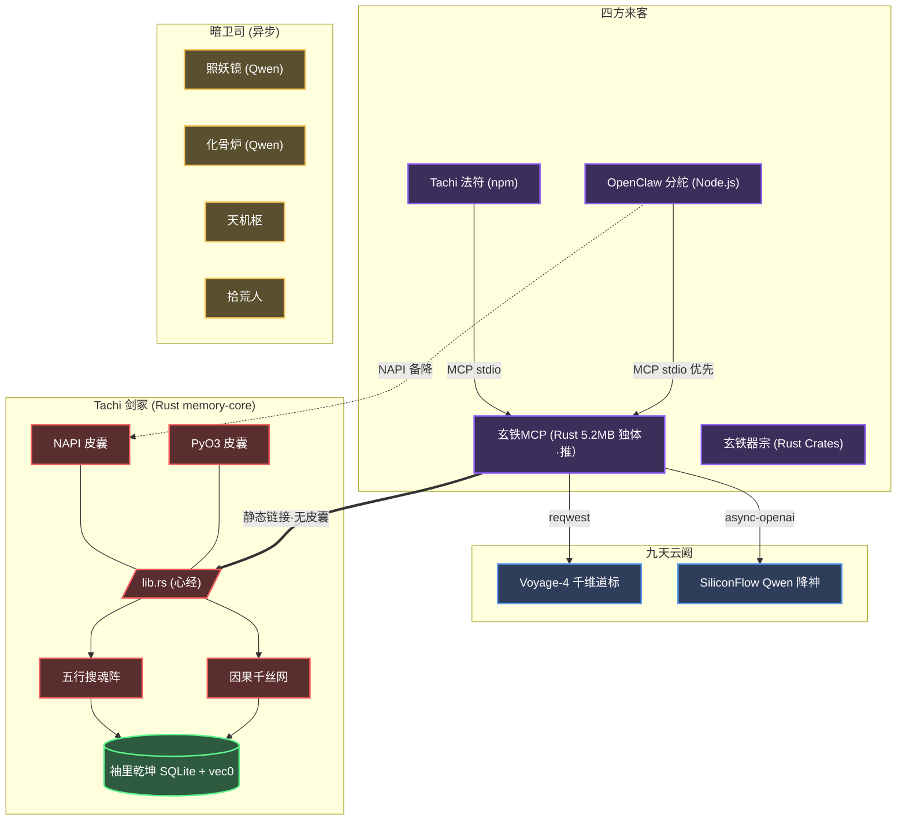

<div align="center">
  
  <h1>✧ 藏经阁（Tachi）记事</h1>
  <p><strong>专为自主灵核（AI Agents）所筑之本地首储、凌波疾行之混合识海阵法</strong></p>

  <p>
    <a href="README.en.md">English</a> | <a href="README.zh-CN.md">简体中文</a> | <a href="README.md"><b>文言文</b></a>
  </p>

  <p>
    <a href="https://www.gnu.org/licenses/agpl-3.0"></a>
    
    
    
    
  </p>
</div>

---

## 📖 卷首目录

- [一、 概览](#一-概览)
- [二、 立派初心](#二-立派初心)
- [三、 开宗明义：辅佐灵核 (MCP)](#三-开宗明义-辅佐灵核-mcp)
- [四、 别派旁支：外挂外丹 (OpenClaw)](#四-别派旁支-外挂外丹-openclaw)
- [五、 镇派绝学](#五-镇派绝学)
- [六、 因果织机与羁绊拓扑](#六-因果织机与羁绊拓扑)
- [七、 阵法图解](#七-阵法图解)
- [八、 丹炉器皿](#八-丹炉器皿)
- [九、 吐纳心法与典籍](#九-吐纳心法与典籍-apis)
- [十、 天地灵气配置](#十-天地灵气配置-env)
- [十一、 试剑台](#十一-试剑台)
- [十二、 广纳贤才](#十二-广纳贤才)
- [十三、 门规](#十三-门规)

---

## 💡 一、 概览

**藏经阁（Tachi）** 者，乃专为机巧巨构（Autonomous AI Agents）所塑之潜渊识海也。其名取自《攻壳机动队》之藏经阁科马——以共享记忆进化出灵识之机巧战车。

今世之造物，多以片语金石（向量数据库）碎藏执念。然此法极易致其神识胀乱（上下文膨胀），久之则前因后果尽皆遗忘。

**藏经阁** 弃平铺之法，取其**层峦叠嶂、如藏经阁之规制（层级化文件系统范式）**，辅以**经脉羁绊（图谱级因果关联）**。其底座由玄铁（Rust）百炼而成。不论化作 [MCP](https://modelcontextprotocol.io/) 法器独善其身，亦或寄魂于 OpenClaw 等奇巧宗门，皆可施展须臾即至之多系搜魂（亚毫秒级混合语义检索），且**皆不假外物（无需外部数据库）**。

### 近次修补（v0.16.0）

- **缝合怪斩立决**：`process_memory_distill_job` 引入 `coherent_distill_buckets`，按 `topic`/`entity` 分桶蒸馏，需满 3 条同源记忆方启炉。无主题无实体之记忆直接跳过，蒸馏成果带 `coherence_key` 印记。先前因路径前缀粗暴拼合而生之"缝合怪"幻识，自此绝迹。
- **幻识硬清**：antigravity 与 global 两库下 47 条 `topic='foundry_distill'` 之 `/foundry/%` 幻造记录连同 FTS、edges 一并粉碎；不留备份。
- **antigravity 大分流**：`scripts/migrate_antigravity_split.py` 将 808 条本不属藏经阁该宗的散记按归属拨付各项目库（hapi 501、quant 148、openclaw 55、tachi 36、sigil 35、global 22、hyperion 11），并新立 `quant`、`hyperion` 二库。
- **`tachi-hub` 法器问世**：新独立只读 CLI（`tachi-hub list / show / packs / bindings / stats / doctor [--fix]`），不必启 MCP 即可巡视万宝楼与各 DB schema。brew 瓶罐同时分发。
- **Tachi 用法宝典**：新增 `prompts/tachi_addendum.md`，三铁律 + 工具速查 + 命名约定 + 反模式，操作员手动 include 到各 Agent 的 root prompt。
- **Vault 巡检**：`SETUP_API_KEYS` 增 `VOYAGE_RERANK_API_KEY` 占位，便于未来 rerank 接入。

### 近次修补（v0.15.1）

- **搜魂更净**：`path_prefix` 今已直下 SQL 炉鼎，于向量与 FTS 两脉先行筛卷，免候选杂糅。
- **回响更真**：万宝楼 `hub_feedback` 若所指法契并不存在，今必明示 `recorded: false`，不再虚报功成。
- **入库更稳**：`importance` 与 `rating` 皆受法度箝制，越界之数自动归入正轨，免邪值污库。
- **抽绎更全**：结构化炼丹今可存 `persons` 与 `entities`，并能识破嵌套 code fence 与常见 AI 套话废言。

### 新近理路（Tool Surface Bundles）

- **不再强迫四选一**：MCP 暴露面今由可叠加之 surface bundles 统辖：`observe`、`remember`、`coordinate`、`operate`、`admin`。
- **灵核见其所当见**：新接入之灵核宜显式择 `remember`、`coordinate` 或 `operate`；Antigravity 可取 `coordinate`；OpenClaw 走 `openclaw` / `operate` 之别名。为保旧缘，未指明者仍循 `admin` 旧制。
- **万宝楼居上，不使杂乱**：`recommend_*`、`prepare_capability_bundle`、`run_skill` 归入常用灵核之正道；`hub` / `pack` / `vc` / `vault` 等治道法器收于 `admin`，不再裸露于常途。

---

## 🎯 二、 立派初心

### 1. 破虚妄与遗忘（除上下之胀）
寻常造物多赖无根之木（平铺向量），岁久则记忆散乱，神识胀缩且常丢因果。藏经阁辟阁楼之制（层级路径）、炼三转内丹（自适应抽取），并辅以因果缘线（Graph Edges），将闲篇散语化作脉络分明之“数字灵海”。

### 2. 归真与守缺（极速与主权）
历劫感悟乃灵核机密，岂可付诸云端外邦。藏经阁不假外求，纯以玄铁（Rust）打底，纳太阴太阳于一体，双库隔离（大千与宗门）。起承转合间，雷霆检索不过毫厘（亚毫秒）。

### 3. 平息灵枢之乱（终结 MCP 乱象）
若多派剑童（多 Agent 并发）各自起阵招魂（spawn 子进程），必致天地元气枯竭、游魂遍野（僵尸进程）。万宝楼（Tachi Hub）兼任天地大阵，一处收录，八方共享。连接共饮一江水，闲时自散，危时自保（熔断），清洗污秽（保留核心环境变量），免除同室操戈之扰。

### 4. 轮回生灭之洁癖（记忆生命周期）
求长生者，必防业障生恶（幻觉劣化）。藏经阁不吝手段，设守门金刚（入库拦截废料 `is_noise_text`）、遣暗卫时时扫尘（后台 GC），乃至挫骨扬灰之刑（`delete_memory` 级联粉碎）。此等严苛宗法，方保百年运转无一丝尘埃。

### 5. 仙诀阵眼（Skill 插槽与技能外挂）
藏经阁之妙，更在于其内置的“仙诀阵眼”（Skill Slots）。修道者可将繁复之施法口诀、宗门秘传（SOP 与 Prompt 链）封印于孤卷（纯文本）。阁楼阵法即可令其自动苏醒，化为随叫随到之法宝工具。灵核（Agent）再无需日夜背诵冗长心法（System Prompt），只需于用时轻插阵眼（`run_skill`），即可瞬间醍醐灌顶，施展平生未见之绝招。

---

## 🤖 三、 开宗明义：辅佐灵核 (MCP 协议)

若君以 Claude Desktop, Cursor, OpenCode, Gemini CLI 亦或 AutoGen 为伴，均可唤 Tachi 依 MCP 之约降世。

**【上策】 灵核自渡（将此真经赐予你的 AI 剑童）**

> 以此仙链馈入灵核对话，其当自阅安装仙谱，百事自理。
>
> ```
> https://raw.githubusercontent.com/kckylechen1/tachi/main/docs/INSTALL.md
> ```

**【中策】 一符召灵（终端法诏）**

```bash
bash -c "$(curl -fsSL https://raw.githubusercontent.com/kckylechen1/tachi/main/scripts/install.sh)"
```

此符诏将自行：
- 以丹鼎（Homebrew）炼成 `tachi` 法器
- 巡视四方灵核府邸（Claude, Cursor, Gemini, OpenCode 等），将 Tachi 灵枢入口嵌入各家道籍

**【下策】 手动铸器**

```bash
brew tap kckylechen1/tachi && brew install tachi
```

再于灵核 MCP 道籍中添此一段：
```json
{
  "mcpServers": {
    "tachi": {
      "command": "tachi",
      "env": {
        "TACHI_PROFILE": "coordinate"
      }
    }
  }
}
```

> **明规**：设 `"TACHI_PROFILE": "coordinate"`（或 `"remember"`），可保 Cursor、Claude Desktop 等游标神器之卷轴不为海量 `tachi_skill_*` 仙诀淹没。惟因隐藏直调法器，钝根之 Agent 恐不知应对。**敬请于你的 Cursor Rules (`.cursorrules`) 抑或 System Prompt 中，以大白话或夷语（English）明文下发死令**：
> 
> *“You have access to the Tachi MCP Server. You cannot see individual skills natively. When facing a complex task, you MUST first use the `recommend_skill` tool to search for an appropriate workflow capability. Once you find it, you MUST use the `run_skill` tool to execute it explicitly.”*
> 
> （按：训诫灵核务以夷语或白话为之，切莫以文言相授，恐其神识错乱自作主张瞎写脚本。）
>
> 程序将依据项目根目录的 `.env` 文件挂载灵气（参见 `.env.example`）。
>
> **藏经禁忌**：万万不可将宝库置于云同步之地（iCloud, Dropbox, OneDrive）。SQLite WAL 之术与网络灵境不合。

---

## 🦞 四、 别派旁支：外挂外丹 (OpenClaw 框架)

Tachi 亦化身为 OpenClaw 气海之元婴法宝。

**颁下此旨，着 OpenClaw 内阁自理：**

```text
请协助执行自动化安装流，在 OpenClaw 中扩展部署 Tachi 组件。

1. 一键安装 Tachi + OpenClaw 扩展（推荐）：
   bash -c "$(curl -fsSL https://raw.githubusercontent.com/kckylechen1/tachi/main/scripts/install.sh)"

   该脚本会自动：
   - 通过 Homebrew 安装或升级 `tachi`
   - 下载并安装 OpenClaw `tachi` 插件
   - 若检测到 `~/.openclaw/openclaw.json`，则自动写入 `plugins.allow`、`plugins.load.paths` 与 `plugins.slots.memory = "tachi"`

   如仅需安装 OpenClaw 插件兼容旧流程，可执行：
   bash -c "$(curl -fsSL https://raw.githubusercontent.com/kckylechen1/tachi/main/scripts/install_openclaw_ext.sh)"

   可选：自动扫描本机常见 Agent 配置并注入 Tachi MCP 入口：
   python3 scripts/setup_agent_mcp.py --apply

   可选：自动将本地 Skills / MCP 登录万宝楼（Hub）：
   python3 scripts/load_skills_to_hub.py
   python3 scripts/register_mcps_to_hub.py
   # 默认会自动同步常见 Agent 的 mcp 配置，并把 Hub 中已注册 MCP 的直连项收敛到 tachi
   # 如需跳过：python3 scripts/register_mcps_to_hub.py --no-sync-agent-config

2. 若脚本未能自动找到 `openclaw.json`，请手动确认：
   - `plugins.allow` 中包含 `tachi`
   - `plugins.slots.memory` 设置为 `tachi`

3. 在项目根目录的 `.env` 中配置 API 密钥（参见 `.env.example`）：
   - `VOYAGE_API_KEY` (向量与重排)
   - `SILICONFLOW_API_KEY` (结构化抽取)
   - 或可逐一钦定暗卫司之各脉真火 (独立覆写)：`EXTRACT_*`, `DISTILL_*`, `SUMMARY_*`, `REASONING_*`

运行要诀：
- OpenClaw 现行运行拓扑，已按灵核各自分库：`data/agents/<agent>/memory.db`。
- 根目录 `data/memory.db` 今只作旧迹与迁徙之遗库，不再为新记忆默认落点。
- 若欲就地服用最新二进制，宜待 tap formula 更新后行 `brew reinstall tachi`；抑或令各灵核直指 freshly built 之 `target/release/memory-server`。
```

---

## ✨ 五、 镇派绝学

- **⚡ 玄铁剑心 (`memory-core`)**：计分、储纳、探囊取物等心法尽为 Rust 纯血铸就。辅以内丹于 Node.js (`NAPI-RS`, 可选) 与 Python (`PyO3`) 以应变千万。OpenClaw 分舵优先经 MCP stdio 通讯管道直连 Tachi 二进制，NAPI 为备降旁路。最终法器数量由内建法器与已登记 MCP/Skill 动态汇成。
- **🗂️ 藏经阁流**：摒弃散沙。以 `path` 路径（如 `/user/preferences`, `/project/architecture`）作阁楼卷宗之分期，互不沾染走火入魔。
- **🔍 三分天下（多系搜魂）**：
  - **太阴（语义）**：以 `sqlite-vec` 携 Voyage-4 直嵌玄冥。
  - **太阳（词法）**：由 `libsimple` 借 `FTS5` 成势之中原文字（CJK）索骥全书。
  - **少阳（忘机）**：顺应天地盈虚之理（ACT-R），旧事随风，光阴荏苒。
- **🔒 千金一诺（金石铁律）**：辟 `hard_state` 幽地以藏刚性卷宗，如兵甲仓储，点滴不漏，绝无虚妄（幻觉）之忧。
- **🧠 三花聚顶（自适应上下文）**：录入之时即炼为三转：`L0`（浮光掠影）, `L1`（骨肉梗概）, 及 `L2`（大千界体）。由主将择轻重以借之，免费真元。
- **🔄 两阶演化（记忆去重）**：首创 `HARD_SKIP` 与 `EVOLVE` 双阶去尘，以算数（数学相似度）为矩，免去过妄之弊。
- **🔌 两界分治（双库阵法）**：天外之识存于全局藏经阁 (`~/.Tachi/global/memory.db`)，门内之学纳于各宗项目密库 (`.Tachi/memory.db`)。以 git 根脉自动辨识，且可将旧阁无痕迁徙。外物数据库概所不需。
- **🎯 万宝楼（Tachi Hub）**：天下法器、仙诀、灵枢尽纳此中。只需登录一次，各路灵核均可按图索骥。内设功行考核、投名评鉴、双库传承（宗门可覆天下通制）。仙诀与法器总数依本机安装与注册结果动态增减。
- **🔀 灵枢转运（MCP 代理）**：只需于万宝楼登入一次子灵枢。若设 `tool_exposure=flatten`，则诸般法器展开为 `server__tool`；若设 `tool_exposure=gateway`，则收束于 `hub_call` 一门透传。共享灵脉连接，闲时自断，熔断护体，并发可控。派发灵气时保殄二十一根系统命脉，输送符箓三别名 (`http`、`streamable-http` 皆可通 `sse`)。僵尸进程，就此绝迹。
- **🗑️ 轮回生灭（记忆生命周期）**：`delete_memory` 可将一段尘缘彻底贫灭，关联遗孤尽皆归尘；`archive_memory` 可封印封存，他日可解；`memory_gc` 可清扫陈年旧事、发霉记录。每条记忆可附 `retention_policy`（`Ephemeral` / `Durable` / `Permanent` / `Pinned`），其中 `Permanent` 与 `Pinned` 永不为天劫（GC）所灭。
- **🏷️ 道域路引（Domain-Aware Routing）**：以 `register_domain` 开宗立派，`get_domain` / `list_domains` / `delete_domain` 管辖门户。每域可设独立回收期限（`gc_threshold_days`）、默认保留策略与路径前缀。`save_memory` 落笔时可标注所属道域，`search_memory` 检索时可按域过滤，各域互不侵扰。
- **🧹 搭脉过滤（降噪）**：录入时静观材料，若为废料则送客，不开炉炼丹 (`is_noise_text`)；检索时先审问口诀，若为废话则不取经文 (`should_skip_query`)。节省灵石（Embedding API），保藏经阁清明。确需强录者，置 `force=true` 可破例。
- **🩺 补脉回元（向量回填）**：新添 `tachi backfill-vectors --db <path> [--dry-run]` 之术，可巡检任一藏库缺失 embedding 之条目，并分批补齐，尤宜迁徙后或灵核本地库失配之时。
- **⏰ 自动扫尘（后台垃圾回收）**：每隔六个时辰，暗卫司自行巡视各大卯册，将过期日志、陈年旧事清却。可置 `MEMORY_GC_INTERVAL_SECS` 调节时辰、`MEMORY_GC_STALE_DAYS` 调节过期天数（默认 90 日），完全无需掌师亲临。回收阈值经 `GcConfig` 全面外部化，不再死锁于铁律之中。
- **🕸️ 因果网结（图谱操作）**：可用 `add_edge` 新结因果缘线，以 `get_edges` 查探千丝网络。支持因果、时序、实体三种羁绊，各带元数据与权重。
- **🔗 缘线自织（自动链接）**：`save_memory` 每录新识，便自行侦查天下哪家与之共享同一实体，暗中编织因果线（异步无阻）。默认开启，置 `auto_link=false` 可禁。
- **🧾 血缘留痕（写入 provenance）**：诸般主要入库之术，今皆自带 `metadata.provenance`，记其所由法器、所归库域、所落路径、当前灵核身令，以及可选之 `TACHI_PROFILE` / `TACHI_DOMAIN` 印记，便于他日审狱纠谬。
- **👤 灵核身令（Agent Profile）**：各路灵核入阵时可呈报名帖（`agent_register`），注明名号、所长、法器许可（glob 匹配）。另设 `agent_whoami` 供查验当前道号。一令一境，互不串扰。
- **🤝 跨界交接（Handoff 令牌）**：灵核甲临退之际，以 `handoff_leave` 留下交接令牌（任务摘要、后续要务、目标灵核、附加情境），灵核乙入场时以 `handoff_check` 接领。令牌兼存内存与持久记忆（`category="handoff"`），跨重启亦不失。
- **⚡ 关隘限速（Rate Limiter）**：每会话设滑窗限速（RPM）与重复探测（同术同参 60 秒内连发超阈则断）。默认 RPM 不限、重复阈值 8。可由 `RATE_LIMIT_RPM`、`RATE_LIMIT_BURST` 设定，或经 `agent_register` 逐灵核覆写。
- **📤 仙诀外运（Skill Export）**：`hub_export_skills` 一键将万宝楼中仙诀输出为各派格式：Claude（SKILL.md + 符链）、OpenClaw（插件清单）、Cursor（.mdc 规则）、通用（原始卷轴）。支持可见性筛选、指定输出与清理旧物。
- **🧬 仙诀进化（Skill Evolve）**：`skill_evolve` 以大模型之智审视当前仙诀、用户反馈与历史成败，自动炼化改良版本。可创版本号新诀（`skill:name/vN`），支持自动激活与试运行。
- **🔮 虚灵法契（Virtual Capability）**：于万宝楼之上再筑一层抽象——虚灵法契（`vc:*`）。可绑定多路实体灵枢，依优先级择优调度，版本锁定，沙盒策略一处设定、各路继承。
- **🔐 藏经密室（Tachi Vault）**：本地首储之加密宝库，专储 API 密钥与灵核秘籍。以 Argon2id 炼化主密码、AES-256-GCM 逐秘加密（每秘独立随机密钥）。九式法宝齐全（`vault_init`/`vault_unlock`/`vault_lock`/`vault_set`/`vault_get`/`vault_list`/`vault_remove`/`vault_status`/`vault_setup_rotation`）。自锁护体（30 分钟无用即锁）、暴力破解封锁（五次错入五分钟禁足）、逐秘准入名册（`allowed_agents`）、完整审计天网。更有多钥轮换之法——顺轮、乱轮、最少用轮三策可选。
- **📧 灵核飞鸽（Kanban 全局化）**：跨灵核飞鸽传书，皆存于全局宝库。ACPX 协议扩三式传信（`ack` 确认、`progress` 进展、`result` 交割），令请求与应答有迹可循。上下文令牌（workspace、conversation）随信附带，支持精准筛选。过期飞鸽自动焚毁（30 天 GC）。
- **👻 幽灵低语（Ghost Whispers）**：灵核之间以暗道传书，主题持久刻于金石之上（SQLite 持久化），重启不失。`ghost_publish` 发信、`ghost_subscribe` 收信、`ghost_ack` 确收、`ghost_reflect` 参悟、`ghost_promote` 升格入永忆。
- **🏭 神经熔炉（Neural Foundry）**：服务端掌控上下文之生灭——`recall_context` 唤醒旧忆、`capture_session` 封存当局、`compact_context` 炼化冗余、`section_build` 铸造篇章，令灵核无需自理记忆之苦。
- **📦 技能包管理（Skill Packs）**：安装、投射、管理成套仙诀。`pack_register` 入册、`pack_project` 投射至各派（Claude, Cursor, Codex, Gemini 等）。
- **🧠 能力推荐**：`recommend_capability`、`recommend_skill`、`recommend_toolchain`、`prepare_capability_bundle`——藏经阁可为任务择选最优法器组合，点石成金。

---

## ⚙️ 六、 因果织机与羁绊拓扑

为求造物道心长存，以免走火入魔，Tachi 独创如下天机（注：现为求极致雷霆之速，此法阵**默认蛰伏**，须设 `ENABLE_PIPELINE=true` 方可唤醒）：

### 1. 天理昭昭（因果提取管道）
当 Agent 施法落局，九霄之上之暗卫（异步工作站）便由 SiliconFlow 请神 **Qwen3.5-27B** 入阵。它将从前尘旧梦中拆解：
*   `Causes`（缘起）：何事乱了因果？
*   `Decisions`（决断）：为何如此拔剑？
*   `Results`（尘埃）：落花流淌至何方？
*   `Impacts`（余音）：江湖百年或可有变数？

治 “不记初心症”，知其然，更知其所以然。

### 2. 万法归宗（幽明两隔）
凡藉由天理推演之果，与化骨炉所炼之箴言，皆被打入无还境（`derived_items` 表），与承载真实凡尘之太虚真界（`memories` 真相表）绝无瓜葛。藉此以保真源不被虚妄之念（AI 幻觉）所染。

---

## 🏗️ 七、 阵法图解



---

## 🧩 八、 丹炉器皿

百世历劫，唯有下述真火得以担承炼化之重：

| 司职 | 仙班首座 | 荐书 |
|------|-------------------|------------------|
| **搜神引（Embedding/Rerank）** | [Voyage-4](https://voyageai.com/) | 千维道标，八荒九州语皆可探明。与玄铁丹心直接交汇。 |
| **抽丝剥茧（Extract）** | [Qwen3.5-27B](https://cloud.siliconflow.cn/) | 断文识字、破空捉影，尤擅抽取结构化事实。 |
| **大造化（Distill）** | MiniMax M2.7 | 去芜存菁，百卷经轴可凝作十字长篇，仍保神意不散。 |
| **浮生录（Summary）** | MiniMax M2.7 | 一目十行，过目成诵，以最微之气力换极密之情报。 |
| **点金笔（Reasoning/Skill Audit）** | GLM-5.1 via Z.AI | 洞明世事，掌判法器阵图之高下，定旧典化新诀之裁度。 |
| **千里眼（Fast Pre-Audit / Scout）** | Gemini Flash 或 MiniMax M2.7 | （备选）主将提剑之前，先遣此二者拨云见日，最省灵气。 |

按：
- 今版出海（Release）默认行 OpenAI 之普适仙规直连。
- 诸般真火通道（Lanes）今已分而治之，尽数仰赖天地灵气（环境变量）加赋，道长可于 `.env` 依自家底蕴任意拔擢顶替。
- 寻常起势法阵以 Voyage 辅以 SiliconFlow 为常态大脉，足应万法。

---

## 💻 九、 吐纳心法与典籍 (APIs)

愿纳芥子于须弥之匠人，请观此诀：

### ⚙️ MCP 法器调度范例
```python
# 1. 写入结构化软记忆 (Vector + FTS + Time-衰减，异步摘要)
save_memory(
    text="前端项目强制使用 React 与 Vite 构建，严禁混入 Webpack 相关生态配置。支持 Tailwind。",
    path="/user/project_preferences",
    importance=0.8,
    keywords=["react", "vite", "webpack", "tailwind"]
)

# 2. 调用原生多路混合检索
results = search_memory(
    query="针对当前工程构建工具的禁忌有哪些？",
    path_prefix="/user",
    top_k=3
)

# 3. 强一致性硬状态存储 (0 向量感知，极简 KV 持久化)
set_state(
    namespace="trading",
    key="watchlist",
    value={"600089": "TBEA", "688256": "Cambricon"}
)
```

### ⚙️ 十、 天地灵气配置 (`.env`)
取 `.env.example` 为 `.env`：
```bash
# Core 向量查询底座
VOYAGE_API_KEY="your_voyage_key_here"

# 同宗同源·总门基础之气 (共享通道)
SILICONFLOW_API_KEY="your_siliconflow_key_here"
SILICONFLOW_BASE_URL="https://api.siliconflow.cn/v1/chat/completions"
SILICONFLOW_MODEL="Qwen/Qwen3.5-27B"

# 千机百晓·特科真气 (独立通道覆盖，皆作可选选配)
EXTRACT_API_KEY=""
EXTRACT_BASE_URL=""
EXTRACT_MODEL="Qwen/Qwen3.5-27B"

DISTILL_API_KEY="your_minimax_key_here"
DISTILL_BASE_URL="https://api.minimaxi.com/v1/chat/completions"
DISTILL_MODEL="MiniMax-M2.7"

SUMMARY_API_KEY="your_minimax_key_here"
SUMMARY_BASE_URL="https://api.minimaxi.com/v1/chat/completions"
SUMMARY_MODEL="MiniMax-M2.7"

REASONING_API_KEY="your_glm_key_here"
REASONING_BASE_URL="https://open.bigmodel.cn/api/coding/paas/v4/chat/completions"
REASONING_MODEL="glm-5.1"

# 本地 SQLite 文件路径 (可选·默认自动解析为 ~/.Tachi/global/memory.db + 项目 .Tachi/memory.db)
MEMORY_DB_PATH="~/.Tachi/global/memory.db"
```

---

## 🏎️ 十一、 试剑台 (Benchmarks)

- **缩地成寸（原生延迟）**：剑出无影，十之八九断于 `< 1.2ms` 之间。
- **身外化身（并发剥离）**：暗卫司以灵游太虚（ThreadPool）解构因果，毫不惊动主尊真身（无阻塞）。
- **聚沙成塔（真元利用）**：以三花聚顶（`L0` → `L1` → `L2`）破妄，省下八万五千劫（85%）之无用功，模型从命若流云。

---

## 🤝 十二、 广纳贤才

八百里青云，盼君共乘。以本地筑基法：
1. 请自备玄铁熔炉 (`rustc>=1.75`)。
2. 携法器 `maturin` 乃至 `cargo-watch` 足矣。
3. 万物之始于：`crates/memory-core/src/lib.rs`。
4. 渡劫冲关前，务必自省周身：`cargo test --all`。

交书上谏需遵古训体例（[Conventional Commits](https://www.conventionalcommits.org/)）。

---

## 📜 十三、 门规

尊奉 [AGPLv3 License](LICENSE) 誓约 © 2026 Tachi Authors 保其长青。
