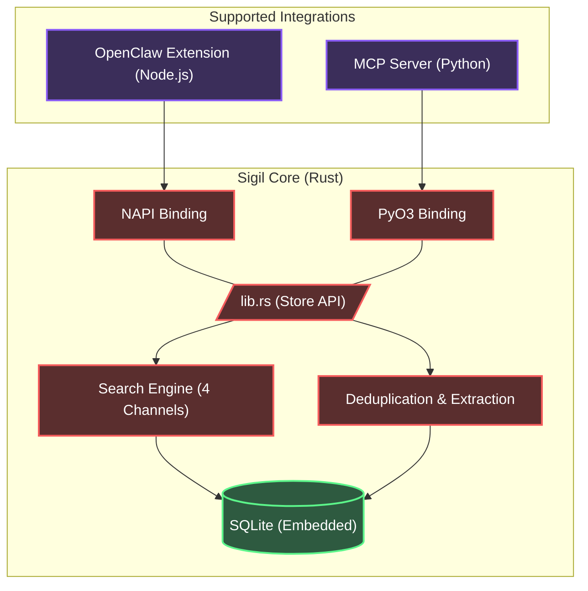

<div align="center">
  <h1>✧ Sigil</h1>
  <p><strong>A Local-First, High-Performance Hybrid Context Database for AI Agents</strong></p>

  <p>
    <a href="README.md">English</a> | <a href="README.zh-CN.md">简体中文</a>
  </p>

  <p>
    <a href="https://opensource.org/licenses/MIT"></a>
    
    
    
  </p>
</div>

---

**Sigil** is an embedded, unified context and memory management system designed specifically for AI Agents. It abandons flaky, flat memory structures in favor of a **hierarchical, file-system-like paradigm** backed by highly optimized Rust code. 

Whether you are building a Model Context Protocol (MCP) server or extending an agent framework like OpenClaw, Sigil provides sub-millisecond, multi-modal semantic retrieval with zero external database dependencies.

## ✨ Features

- **⚡ Blazing Fast Rust Core**: The entire scoring, storage, and retrieval engine is written in Rust, wrapped dynamically for Node.js (`NAPI-RS`) and Python (`PyO3`).
- **🗂️ Filesystem Paradigm**: Context is not a flat list. Memories are organized hierarchically by `path` (e.g., `/user/preferences`, `/project/architecture`).
- **🔍 4-Channel Hybrid Search**:
  - **Semantic**: Built-in Voyage-4 vector embedding search (`sqlite-vec` KNN).
  - **Lexical**: Native CJK (Chinese, Japanese, Korean) full-text search (`libsimple` + `FTS5`).
  - **Symbolic**: Exact keyword and entity matching.
  - **Decay**: ACT-R cognitive architecture-inspired recency decay.
- **🧠 3-Tier Context Loading**: Auto-extracts `L0` (Abstract), `L1` (Overview), and `L2` (Full Text) to save tokens.
- **🔌 Zero Ops**: Packaged as a single SQLite file (`memory.db`), completely embedded. No Redis, no Neo4j, no ChromaDB required.

---

## 🏗️ Architecture



---

## 🚀 Quick Start

First, clone the repository and configure your environment details:

```bash
git clone https://github.com/your-org/sigil.git
cd sigil
cp .env.example .env
```

Ensure you populate `.env` with the necessary API keys for embedding (e.g., Voyage) and extraction (e.g., GLM-4/Qwen3 via SiliconFlow).

### Option A: Running as an MCP Server (Python)

Sigil comes with a production-ready Model Context Protocol (MCP) server, perfect for Claude Desktop, Cursor, or AutoGen.

1. **Install uv / maturin** (if you haven't already):
   ```bash
   pip install uv maturin
   ```
2. **Setup virtual environment and compile Rust bindings**:
   ```bash
   cd mcp
   uv venv
   source .venv/bin/activate
   
   # Build the Rust memory_core_py binding directly into the venv
   cd ../crates/memory-python
   maturin develop --release
   cd ../../mcp
   
   # Install MCP dependencies
   pip install -r requirements.txt
   ```
3. **Configure MCP Client**:
   Point your `mcp_config.json` command to `.venv/bin/python3` running `mcp/server.py`.

### Option B: Using the OpenClaw Extension (Node.js)

Sigil can run as a native OpenClaw extension to manage contextual memory.

1. **Setup Node and build Rust bindings**:
   ```bash
   cd integrations/openclaw
   npm install
   
   # Build the NAPI-RS binding (.node file)
   npm run build
   ```
2. **Install to OpenClaw**:
   Symlink or move the `openclaw` directory to your agent's `local-plugins/extensions/` directory.

---

## 🧠 Memory Consolidation & Merge Strategy

Sigil supports memory consolidation analogous to the concept of a "Session Commit" or "Recursive Consolidation".

When new context is added via `save_memory`:
1. The **Semantic Search** runs a pre-filter (`threshold > 0.85`).
2. If exact duplicates exist (`threshold >= 0.92`), the new entry is **skipped**.
3. *[Coming Soon]* If highly similar concepts exist (`0.85 - 0.92`), the system queues an asynchronous **LLM Merge** to combine complementary facts, deleting historical fragmentation.

---

## 🏎️ Benchmarks

* **End-to-end P95 Latency (Rust)**: < 1.5ms
* **Token Efficiency**: Sigil's `L0` generation reduces retrieval payload by up to **85%** compared to naive RAG text fetching, vastly improving response times and contextual coherence.

---

## 📜 License

[MIT License](LICENSE) © 2026 Sigil Authors.
