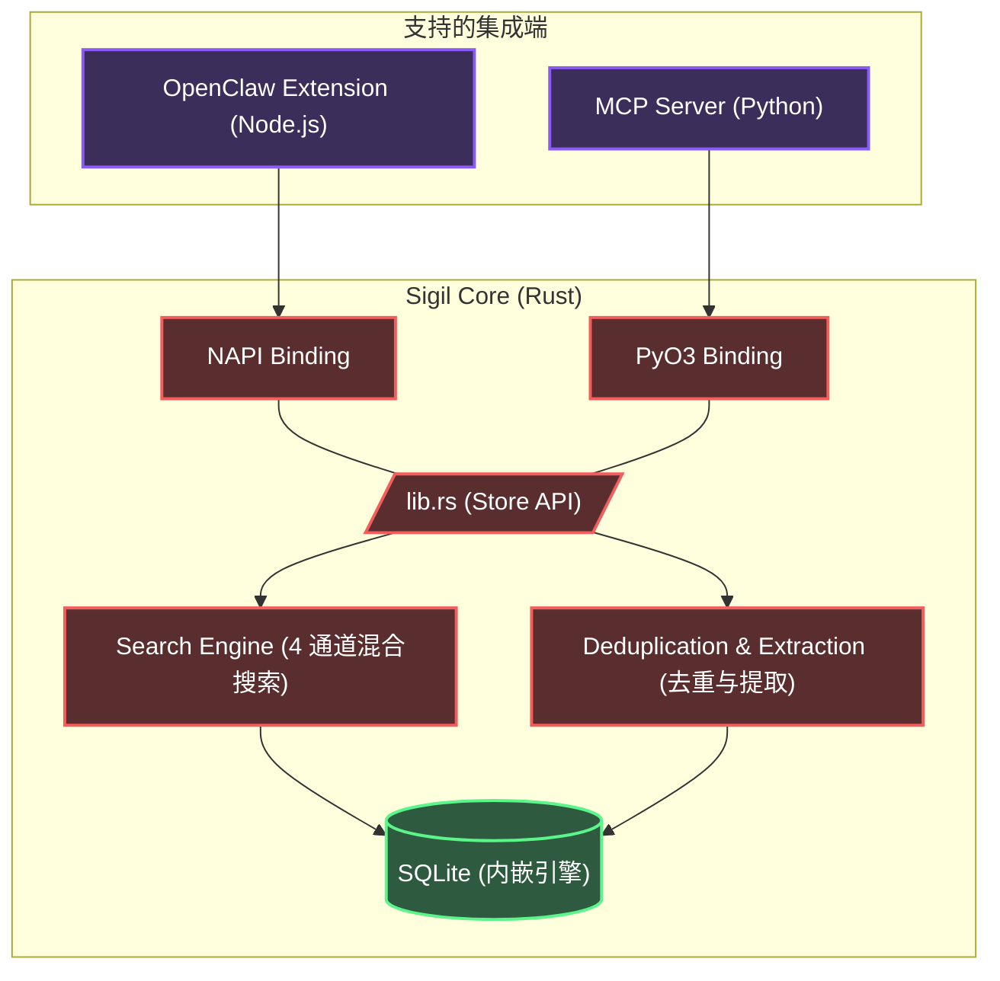

<div align="center">
  <h1>✧ Sigil</h1>
  <p><strong>专为 AI Agent 打造的本地优先、高性能混合上下文数据库</strong></p>

  <div align="center">
    
  </div>

  <p align="center">
    <a href="README.md">[English]</a> | <b>[简体中文]</b>
  </p>

  <p>
    <a href="https://opensource.org/licenses/MIT"></a>
    
    
    
  </p>
</div>

---

## 🏃 快速运行记忆提取评测

```bash
# 进入评测脚本目录
cd /Users/kckylechen/Desktop/Sigil/integrations/openclaw

# 确保 SILICONFLOW_API_KEY 已设置
export SILICONFLOW_API_KEY='你的API密钥'

# 运行评测 (对比 Qwen3-8B vs GLM-4-9B)
npx tsx benchmark_extraction.ts

# 评测结果将保存到: benchmark_extraction_result.json
```

---

**Sigil**（魔法刻印/符文）是一个专门为 AI Agent 设计的内嵌式、统一上下文与记忆管理系统。它摒弃了脆弱的扁平化记忆结构，转而采用由高度优化的 Rust 代码支撑的**层次化、类似文件系统的管理范式**。

无论你是构建 Model Context Protocol (MCP) 服务器，还是扩展像 OpenClaw 这样的智能体框架，Sigil 都能提供亚毫秒级、多模态语义检索能力，且**零外部数据库依赖**。

## ✨ 核心特性

- **⚡ 极速 Rust 内核**：整个打分、存储和检索引擎完全使用 Rust 编写，并通过动态绑定支持 Node.js (`NAPI-RS`) 和 Python (`PyO3`)。
- **🗂️ 文件系统范式**：上下文不再是扁平的列表。记忆根据 `path`（路径）进行分层组织（例如 `/user/preferences`, `/project/architecture`）。
- **🔍 4 通道混合搜索**：
  - **语义检索**：内置 Voyage-4 向量嵌入搜索 (`sqlite-vec` KNN)。
  - **词法检索**：原生 CJK（中日韩文）全文检索支持 (`libsimple` + `FTS5`)。
  - **符号匹配**：精确的关键词与实体匹配。
  - **时间衰减**：基于 ACT-R 认知架构启发的记忆近期衰减算法。
  - **精排重排**：混合召回后经 Voyage Rerank-2.5 交叉编码器精排。
- **🧠 强类型记忆提取**：将记忆严格分类为 `preference`（偏好）、`decision`（决策）、`entity`（实体）、`fact`（事实）、`other`（其他）五种类型，支持 Schema 校验。
- **🧠 3 级上下文加载**：自动提取 `L0`（摘要）、`L1`（概览）和 `L2`（全文），大幅节省 Token 开销。
- **🔌 零运维负担**：所有数据打包在单一的 SQLite 文件 (`memory.db`) 中，完全内嵌。不需要启动 Redis、Neo4j 或 ChromaDB。

### 🧩 模型栈

| 角色 | 模型 | 选型理由 |
|------|------|----------|
| **向量嵌入** | [Voyage-4](https://voyageai.com/) | 1024 维向量，多语言检索顶级水准。注册即送 **2 亿免费 tokens**。 |
| **重排序** | [Voyage Rerank-2.5](https://voyageai.com/) | 混合召回后的交叉编码器精排。与 Embedding 共用同一个 API Key。 |
| **事实提取** | [GLM-4-9B](https://cloud.siliconflow.cn/i/QwFqsLF1) via SiliconFlow | 结构化事实提取速度最快、准确度最高（横评过 Qwen3-8B、Llama 等）。有免费额度。 |
| **摘要生成** | GLM-4V-Flash | 超快速 L0 单句摘要生成。 |

---

## 🏗️ 架构图



---

## 🚀 快速开始

### 🤖 给你的 Coding Agent (Claude / Cursor / Antigravity)

> **复制以下内容粘贴给你的 AI 编程助手，让它帮你搭建 Sigil MCP 记忆服务器：**

```
帮我安装配置 Sigil —— 一个 AI agent 本地记忆系统。

1. 克隆仓库: git clone https://github.com/kckylechen1/sigil.git && cd sigil
2. 配置 API Key: cp .env.example .env，然后填入我的 key。
3. 搭建 MCP server:
   cd mcp && python3 -m venv .venv && source .venv/bin/activate
   cd ../crates/memory-python && pip install maturin && maturin develop --release
   cd ../../mcp && pip install -r requirements.txt
4. 在我的 mcp_config.json 里添加:
   {
     "mcpServers": {
       "memory": {
         "command": "<绝对路径>/sigil/mcp/.venv/bin/python3",
         "args": ["<绝对路径>/sigil/mcp/server.py"]
       }
     }
   }

服务器会自动从项目根目录的 .env 文件加载 API Key，无需在 mcp_config 中传入。

如果我还没有 API Key，帮我注册：
- Voyage API（向量嵌入+重排）: https://dash.voyageai.com/ — 免费 2 亿 tokens，无需信用卡
- SiliconFlow（事实提取）: https://cloud.siliconflow.cn/i/QwFqsLF1 — 有免费额度
```

### 🦞 给你的 OpenClaw

> **复制以下内容粘贴给你的 OpenClaw agent，让它帮你安装 Sigil 原生记忆扩展：**

```
帮我用一键脚本安装 Sigil 作为 OpenClaw 的记忆扩展。

1. 运行自动安装脚本:
   bash -c "$(curl -fsSL https://raw.githubusercontent.com/kckylechen1/sigil/main/scripts/install_openclaw_ext.sh)"

2. 脚本会自动克隆或更新仓库、构建 Rust NAPI 模块、编译 OpenClaw 插件、执行一次加载冒烟测试，并建立到 OpenClaw 扩展目录的软链接。

3. 脚本完成后，请在 `plugins.allow` 中启用 `memory-hybrid-bridge`；如果你使用 `plugins.slots.memory`，也把它指向 `memory-hybrid-bridge`；最后再补齐 `.env` 中尚未导出的 API Key。

如果我还没有 API Key，帮我注册：
- Voyage API（向量嵌入+重排）: https://dash.voyageai.com/ — 免费 2 亿 tokens，无需信用卡
- SiliconFlow（事实提取）: https://cloud.siliconflow.cn/i/QwFqsLF1 — 有免费额度
```

---

### 手动安装

首先，克隆仓库并配置环境变量：

```bash
git clone https://github.com/kckylechen1/sigil.git
cd sigil
cp .env.example .env
```

请确保在 `.env` 中填入必要的 API 密钥：
- **Voyage API** (`VOYAGE_API_KEY`)：用于向量嵌入(Embedding)和重排(Rerank)。[点击此处注册](https://dash.voyageai.com/) 即可获得 **2 亿免费 tokens**。
- **提取 API** (`SILICONFLOW_API_KEY`)：用于事实提取和摘要。经过我们内部的大量横向对比测试，我们强烈建议使用 **GLM-4**（例如通过 SiliconFlow 调用 `THUDM/glm-4-9b-chat`），它在事实提取的速度和准确度上表现最为出色。

### 选项 A：作为 MCP Server 运行 (Python)

Sigil 自带一个生产环境就绪的 Model Context Protocol (MCP) 服务器，完美适配 Claude Desktop, Cursor, 或 AutoGen。

1. **安装 uv / maturin** (如果没有安装的话):
   ```bash
   pip install uv maturin
   ```
2. **设置虚拟环境并编译 Rust 绑定**:
   ```bash
   cd mcp
   uv venv
   source .venv/bin/activate
   
   # 直接将 Rust memory_core_py 绑定编译至 venv 环境中
   cd ../crates/memory-python
   maturin develop --release
   cd ../../mcp
   
   # 安装 MCP 其它依赖
   pip install -r requirements.txt
   ```
3. **配置 MCP Client** — 将以下内容粘贴到你的 `mcp_config.json`（适用于 Claude Desktop / Cursor / Antigravity 等）：
   ```jsonc
   {
     "mcpServers": {
       "memory": {
         "command": "/path/to/sigil/mcp/.venv/bin/python3",
         "args": ["/path/to/sigil/mcp/server.py"],
         "env": {
           // 注册地址: https://dash.voyageai.com/ （免费 2 亿 tokens）
           "VOYAGE_API_KEY": "你的_voyage_api_key",
           // 注册地址: https://cloud.siliconflow.cn/i/QwFqsLF1 （有免费额度）
           "SILICONFLOW_API_KEY": "你的_siliconflow_api_key",
           "MEMORY_DB_PATH": "~/.sigil/memory.db"
         }
       }
     }
   }
   ```

   > **🤖 Agent 注意**：如果上面的 API Key 为空或未配置，请引导你的人类用户前往注释中的链接注册。两个服务都提供慢慢的免费额度，无需信用卡。

### 选项 B：作为 OpenClaw 插件运行 (Node.js)

Sigil 可以作为原生的 OpenClaw 插件运行，以极低的延迟管理 Agent 的上下文记忆。

1. **安装依赖并编译 Rust 绑定**:
   ```bash
   cd integrations/openclaw
   npm install
   
   # 编译 NAPI-RS 绑定（生成 .node 文件）
   npm run build
   ```
2. **安装到 OpenClaw**：软链接到你的 Agent 扩展目录：
   ```bash
   ln -s $(pwd) ~/.openclaw/local-plugins/extensions/memory-hybrid-bridge
   ```
3. **在 `openclaw.json` 里启用插件**：
   ```jsonc
   {
     "plugins": {
       "allow": ["memory-hybrid-bridge"],
       "slots": {
         "memory": "memory-hybrid-bridge"
       }
     }
   }
   ```
4. **设置环境变量**（添加到 `.zshrc` / `.bashrc`）：
   ```bash
   export VOYAGE_API_KEY="你的_voyage_api_key"
   export SILICONFLOW_API_KEY="你的_siliconflow_api_key"
   ```

### 选项 C：OpenClaw 定时任务（自动化记忆整理）

安装完 OpenClaw 插件后，你可以设置定时任务来自动整理、合并和质检 Agent 的记忆。将以下内容添加到 `~/.openclaw/cron/jobs.json`：

<details>
<summary><b>📋 示例：每日记忆整理（凌晨 03:40）</b></summary>

```json
{
  "agentId": "ops",
  "name": "sigil-memory-daily-curation",
  "enabled": true,
  "schedule": { "kind": "cron", "expr": "40 3 * * *", "tz": "Asia/Shanghai" },
  "sessionTarget": "isolated",
  "wakeMode": "now",
  "payload": {
    "kind": "agentTurn",
    "model": "google/gemini-3-flash-preview",
    "message": "执行每日记忆整理：1) 搜索今天新增的所有记忆。2) 识别并合并近似重复条目。3) 提炼因果链（原因→决策→结果→影响）。4) 将高价值长期事实追加到整合记忆库。5) 输出简短结果：新增事实数、因果链条数、检测到的冲突数。"
  }
}
```

</details>

<details>
<summary><b>📋 示例：增量记忆质检（每 6 小时）</b></summary>

```json
{
  "agentId": "ops",
  "name": "sigil-memory-incremental-check",
  "enabled": true,
  "schedule": { "kind": "every", "everyMs": 21600000 },
  "sessionTarget": "isolated",
  "wakeMode": "now",
  "payload": {
    "kind": "agentTurn",
    "model": "google/gemini-3-flash-preview",
    "message": "执行增量记忆质检：1) 获取最近6小时新增的记忆条目。2) 识别因果断裂（有结果无原因、有决策无依据）。3) 标记矛盾冲突。4) 输出：新增条目数、因果断裂数、冲突数、是否需要人工复核。"
  }
}
```

</details>

---

## 🧠 记忆整合与合并策略 (Consolidation)

Sigil 支持记忆碎片整合（类似于 "Session Commit" 或 "递归整合" 的概念）。

当通过 `save_memory` 写入新上下文时：
1. **语义引擎** 会进行前置过滤（阈值 `threshold > 0.85`）。
2. 若存在高度重合的记忆记录（`threshold >= 0.92`），系统会直接 **跳过（Skipped）** 写入操作。
3. *[即将上线]* 若存在高度相关的概念（`0.85 - 0.92`），系统将压入异步队列触发 **LLM Merge（大模型合并）**，将互补事实无缝融合，消除历史碎片的堆积。

---

## 🏎️ 性能基准

* **端到端 P95 延迟 (Rust 内核)**: < 1.5ms
* **Token 效率**: Sigil 的 `L0` (摘要) 生成机制使得大模型的召回上下文长度对比传统纯文本 RAG 下降了高达 **85%**，极致提升了响应速度和上下文窗口连贯性。

---

## 📜 开源协议

[MIT License](LICENSE) © 2026 Sigil Authors.
