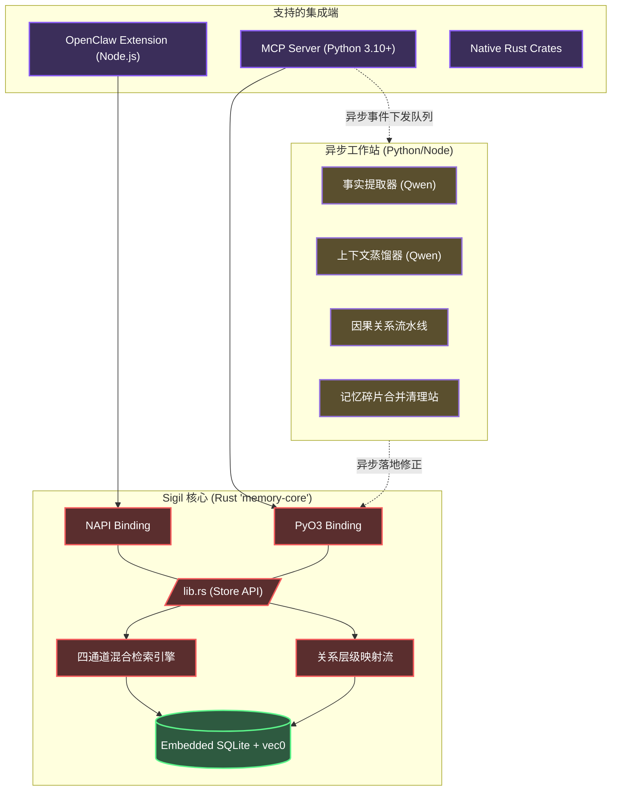

<div align="center">
  
  <h1>✧ Sigil 记忆系统</h1>
  <p><strong>专为自主智能体（AI Agents）打造的本地优先、高性能混合上下文数据库</strong></p>

  <p>
    <a href="README.en.md">English</a> | <a href="README.zh-CN.md"><b>简体中文</b></a> | <a href="README.md">文言文</a>
  </p>

  <p>
    <a href="https://www.gnu.org/licenses/agpl-3.0"></a>
    
    
    
    
    
  </p>
</div>

---

## 📖 目录

- [概览](#-概览)
- [快速开始: Coding Agents (MCP)](#-快速开始-coding-agents-mcp)
- [快速开始: OpenClaw 框架](#-快速开始-openclaw-框架)
- [核心特性](#-核心特性)
- [因果工作台与记忆关联](#-因果工作台与记忆关联)
- [系统架构](#-系统架构)
- [模型栈](#-模型栈)
- [代码接入与 APIs](#-代码接入与-apis)
- [环境变量配置](#-环境变量配置)
- [性能基准](#-性能基准)
- [贡献指南](#-贡献指南)
- [开源协议](#-开源协议)

---

## 💡 概览

**Sigil** 是一个专为全自主智能体（Autonomous AI Agents）设计的嵌入式上下文与记忆管理数据库系统。

当前的 AI 记忆模型大多依赖于向量数据库存储扁平化的文本片段。这种设计极易导致 Agent 的上下文视窗膨胀，并在长时间运行中丢失关键的因果和时间联系。

Sigil 引入了由 Rust 高度优化的**层级化、类文件系统管理范式**与**图谱级因果关联**。无论是作为 [Model Context Protocol (MCP)](https://modelcontextprotocol.io/) 服务器独立运行，还是内嵌于 OpenClaw 等原生框架中，Sigil 均能提供亚毫秒级的多模态混合语义检索，且**无需任何外部独立数据库依赖**。

---

## 🤖 快速开始: Coding Agents (MCP 协议)

对于使用 Claude Desktop, Cursor, 或是 AutoGen 等框架的用户，Sigil 提供了基于模型上下文协议（MCP）的开箱即用支持。

**将以下系统指令输入给你的个人 AI Assistant 进行自动部署：**

```text
请协助我配置安装 Sigil (MCP 记忆服务器)：

1. 克隆仓库: git clone https://github.com/kckylechen1/sigil.git && cd sigil
2. 构建服务端与环境:
   cd mcp && python3 -m venv .venv && source .venv/bin/activate
   cd ../crates/memory-python && pip install maturin && maturin develop --release
   cd ../../mcp && pip install -r requirements.txt
3. 将以下配置追加至 mcp_config.json 配置文件中:
   {
     "mcpServers": {
       "memory": {
         "command": "<使用绝对路径指向>/sigil/mcp/.venv/bin/python3",
         "args": ["<使用绝对路径指向>/sigil/mcp/server.py"]
       }
     }
   }

程序将依据主目录的 .env 文件挂载环境变量。
依赖服务清单：
- Voyage API (向量与重排): https://dash.voyageai.com/
- SiliconFlow (结构化抽取): https://cloud.siliconflow.cn/
```

---

## 🦞 快速开始: OpenClaw 框架

Sigil 支持以外部扩展插件的形式桥接运行于 OpenClaw 内核。

**将以下指令发送至你的 OpenClaw 对话窗交由 Agent 处理：**

```text
请协助执行自动化安装流，在 OpenClaw 中扩展部署 Sigil 组件。

1. 直接运行部署脚本：
   bash -c "$(curl -fsSL https://raw.githubusercontent.com/kckylechen1/sigil/main/scripts/install_openclaw_ext.sh)"

2. 此脚本将负责拉取代码与编译原生的 Rust NAPI 库，进行集成验证并在 extensions 库中建立软链接。

3. 执行完成后请打开 `plugins.allow` 参数权限，并将 `plugins.slots.memory` 设置为 `memory-hybrid-bridge`。最后通过 `.env` 追加相关 Token。
```

---

## ✨ 核心特性

- **⚡ 高性能 Rust 内核 (`memory-core`)**：计分、存储、实体提取与检索等底层引擎完全由 Rust 实现，并为 Node.js (`NAPI-RS`) 和 Python (`PyO3`) 提供原生高性能绑定。
- **🗂️ 文件系统命名空间**：记忆信息摒弃扁平存储，采用 `path` 路径参数（如 `/user/preferences`, `/project/architecture`）进行拓扑层级管理，有效实现业务数据的隔离与精准定向。
- **🔍 四通道混合搜索引擎**：
  - **语义级（Semantic）**：内建基于 `sqlite-vec` 的 Voyage-4 向量聚类查询（KNN）。
  - **词法级（Lexical）**：基于 `libsimple` 和 `FTS5` 构建优化的 CJK（中日韩文）全文索引库。
  - **符号级（Symbolic）**：精准的关键字匹配与分类标签查询。
  - **遗忘曲线（Decay）**：借鉴 ACT-R 经典认知模型的时间惩罚衰减机制。
- **🎯 交叉重排（Reranking）**：在四个检索通道输出候选后，系统自动调用 Voyage Rerank-2.5 交叉编码器进行深度重排，最大化命中精度。
- **🧠 三级自适应上下文分层**：数据接入时将自动被提纯为三个深度：`L0`（摘要提要）, `L1`（段落概览）, 与 `L2`（完整内容）。Agent 可根据当前操作紧急度选取最低成本的维度读取。
- **🔌 零外部依赖部署**：所有数据被安全封装于单一的 SQLite 原生文件库（`memory.db`）中。无需部署 Redis、Neo4j 或 ChromaDB 等中间组件。

---

## ⚙️ 因果工作台与记忆关联

为保证 Agent 系统级别的长期逻辑稳定性，Sigil 引入了深度推理组件：

### 1. 结构化因果提取管道 (The Causal Extraction Pipeline)
当 Agent 完成一轮复杂交互后，Sigil 的完全异步工作站将被唤醒。利用通过 SiliconFlow 接入的 **Qwen3.5-27B** 模型，工具站将解构 Agent 的日志并提取：
*   `Causes`：触发本次操作的根本起因。
*   `Decisions`：采取方案背后的推演逻辑。
*   `Results`：落地的具体结果状态。
*   `Impacts`：对空间可能存在的前置及后置波及影响。

有效防范“AI 失忆症”，让 Agent 记住制定架构变更背后的宏观逻辑，而非仅仅是局部的代码改动点。

### 2. 原生记忆关联拓扑 (Memory Relations)
底层存储层通过图谱数据模型隐式链接独立的事实卡片。这一设计使得 LLM 能够平滑顺藤摸瓜地回溯整个依赖架构与历史背景，而不会使得单次请求超过有限的 Token 支持上限。

---

## 🏗️ 系统架构



---

## 🧩 模型栈

经过严苛测试，以下是系统默认推荐的组件栈模型，能够在延迟、质量与计算成本中取得最佳平衡：

| 职位角色 | 推荐选用方案 | 原理说明 |
|------|-------------------|------------------|
| **特征向量 (Embedding)** | [Voyage-4](https://voyageai.com/) | 1024 高维度向量输出，提供领先的多语种文本检索能力。 |
| **打分重排 (Reranking)** | [Voyage Rerank-2.5](https://voyageai.com/) | 检索引擎初筛后的深度交叉验证，共用 Voyage 密钥环境。 |
| **逻辑提取与快摄 (Extraction & Summarization)** | [Qwen3.5-27B](https://cloud.siliconflow.cn/i/QwFqsLF1) 分片部署 | 面向高精度 JSON 数据集校验、L0 简要提取提供的强大因果推理能力。 |
| **全局蒸馏 (Distillation)** | [Qwen3.5-27B](https://cloud.siliconflow.cn/i/QwFqsLF1) 分片部署 | 用于梳理高层级跨场景行为图谱及全局规则统一沉淀。 |

---

## 💻 代码接入与 APIs

供开发者在原生环境中直接内嵌使用核心引流层：

### ⚙️ Python Environment (`mcp/server.py` 示例)
```python
from memory_core_py import MemoryStore, SearchParams, MemoryEntry

# 初始化持久化存储节点
store = MemoryStore("~/.sigil/memory.db")

# 写入结构化知识与关系
store.save_memory(MemoryEntry(
    text="前端项目强制使用 React 与 Vite 构建，严禁混入 Webpack 相关生态配置。支持 Tailwind。",
    path="/user/project_preferences",
    importance=0.8,
    keywords=["react", "vite", "webpack", "tailwind"]
))

# 调用原生多路混合检索
results = store._search(SearchParams(
    query="针对当前工程构建工具的禁忌有哪些？",
    path_prefix="/user",
    top_k=3
))

# 输出提纯后的精简概要版本
print(results[0].l0_summary)
```

### ⚙️ 环境变量配置 (`.env`)
通过拷贝根目录下 `.env.example` 文件作为 `.env` 参数映射。
```bash
# Core 向量查询底座
VOYAGE_API_KEY="your_voyage_key_here"

# 大模型抽取层与清洗归置
SILICONFLOW_API_KEY="your_siliconflow_key_here"

# 本地 SQLite 文件相对绝对部署区 (可选配置)
MEMORY_DB_PATH="~/.sigil/memory.db"
```

---

## 🏎️ 性能基准 (Benchmarks)

- **原生核心响应 (P95)**：单一混合调度的检索耗时保持在 `< 1.2ms` 范畴。
- **并发提取剥离**：底层的 Python ThreadPool 与协程彻底屏蔽在提取计算时的网络瓶颈，消除对于主事件循环的任何 IO 干扰。
- **Token 保真与利用率**：分层策略 (`L0` → `L1` → `L2`) 搭配严格剪枝，相较传统基于死板文本块的 RAG 设计可大幅降低近 **85%** 的上下文冗余，显著提高大语言模型的指令依从性。

---

## 🤝 贡献指南

我们期待社区的代码提交与架构优化方案。要在本地设立核心开发构建环境：
1. 请确保系统中安装了支持最新版规范的 Rust 编译器 (`rustc>=1.75`)。
2. 安装环境所需的 `maturin` 以及 `cargo-watch` 库。
3. 数据基石入口请查阅：`crates/memory-core/src/lib.rs`。
4. 在任何变更提报前，请落实通过全部编译时断言与代码检查：`cargo test --all`。

请确保所有提交日志遵循 [Conventional Commits](https://www.conventionalcommits.org/) 的基本规范准则。

---

## 📜 开源协议

基于 [AGPLv3 License](LICENSE) © 2026 Sigil Authors。
