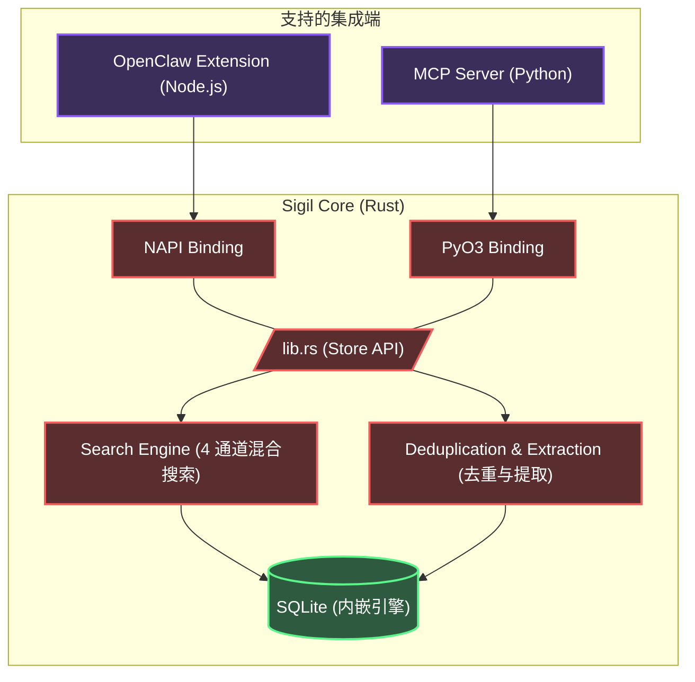

<div align="center">
  <h1>✧ Sigil</h1>
  <p><strong>专为 AI Agent 打造的本地优先、高性能混合上下文数据库</strong></p>

  <p>
    <a href="README.md">English</a> | <a href="README.zh-CN.md">简体中文</a>
  </p>

  <p>
    <a href="https://opensource.org/licenses/MIT"></a>
    
    
    
  </p>
</div>

---

**Sigil**（魔法刻印/符文）是一个专门为 AI Agent 设计的内嵌式、统一上下文与记忆管理系统。它摒弃了脆弱的扁平化记忆结构，转而采用由高度优化的 Rust 代码支撑的**层次化、类似文件系统的管理范式**。

无论你是构建 Model Context Protocol (MCP) 服务器，还是扩展像 OpenClaw 这样的智能体框架，Sigil 都能提供亚毫秒级、多模态语义检索能力，且**零外部数据库依赖**。

## ✨ 核心特性

- **⚡ 极速 Rust 内核**：整个打分、存储和检索引擎完全使用 Rust 编写，并通过动态绑定支持 Node.js (`NAPI-RS`) 和 Python (`PyO3`)。
- **🗂️ 文件系统范式**：上下文不再是扁平的列表。记忆根据 `path`（路径）进行分层组织（例如 `/user/preferences`, `/project/architecture`）。
- **🔍 4 通道混合搜索**：
  - **语义检索**：内置 Voyage-4 向量嵌入搜索 (`sqlite-vec` KNN)。
  - **词法检索**：原生 CJK（中日韩文）全文检索支持 (`libsimple` + `FTS5`)。
  - **符号匹配**：精确的关键词与实体匹配。
  - **时间衰减**：基于 ACT-R 认知架构启发的记忆近期衰减算法。
- **🧠 3 级上下文加载**：自动提取 `L0`（摘要）、`L1`（概览）和 `L2`（全文），大幅节省 Token 开销。
- **🔌 零运维负担**：所有数据打包在单一的 SQLite 文件 (`memory.db`) 中，完全内嵌。不需要启动 Redis、Neo4j 或 ChromaDB。

---

## 🏗️ 架构图



---

## 🚀 快速开始

首先，克隆仓库并配置环境变量：

```bash
git clone https://github.com/your-org/sigil.git
cd sigil
cp .env.example .env
```

请确保在 `.env` 中填入必要的 API 密钥，用于向量嵌入（如 Voyage）和事实提取（如通过 SiliconFlow 调用 GLM-4/Qwen3）。

### 选项 A：作为 MCP Server 运行 (Python)

Sigil 自带一个生产环境就绪的 Model Context Protocol (MCP) 服务器，完美适配 Claude Desktop, Cursor, 或 AutoGen。

1. **安装 uv / maturin** (如果没有安装的话):
   ```bash
   pip install uv maturin
   ```
2. **设置虚拟环境并编译 Rust 绑定**:
   ```bash
   cd mcp
   uv venv
   source .venv/bin/activate
   
   # 直接将 Rust memory_core_py 绑定编译至 venv 环境中
   cd ../crates/memory-python
   maturin develop --release
   cd ../../mcp
   
   # 安装 MCP 其它依赖
   pip install -r requirements.txt
   ```
3. **配置 MCP Client**:
   在你的 AI 客户端配置文件（如 `mcp_config.json`）的 command 中指向 `.venv/bin/python3` 并运行 `mcp/server.py`。

### 选项 B：作为 OpenClaw 插件运行 (Node.js)

Sigil 可以作为原生的 OpenClaw 插件运行，以极低的延迟管理 Agent 的上下文记忆。

1. **安装依赖并编译 Rust 绑定**:
   ```bash
   cd integrations/openclaw
   npm install
   
   # 编译 NAPI-RS 绑定（生成 .node 文件）
   npm run build
   ```
2. **安装到 OpenClaw**:
   将 `openclaw` 目录整体移入或软链接到你 Agent 的 `local-plugins/extensions/` 目录下。

---

## 🧠 记忆整合与合并策略 (Consolidation)

Sigil 支持记忆碎片整合（类似于 "Session Commit" 或 "递归整合" 的概念）。

当通过 `save_memory` 写入新上下文时：
1. **语义引擎** 会进行前置过滤（阈值 `threshold > 0.85`）。
2. 若存在高度重合的记忆记录（`threshold >= 0.92`），系统会直接 **跳过（Skipped）** 写入操作。
3. *[即将上线]* 若存在高度相关的概念（`0.85 - 0.92`），系统将压入异步队列触发 **LLM Merge（大模型合并）**，将互补事实无缝融合，消除历史碎片的堆积。

---

## 🏎️ 性能基准

* **端到端 P95 延迟 (Rust 内核)**: < 1.5ms
* **Token 效率**: Sigil 的 `L0` (摘要) 生成机制使得大模型的召回上下文长度对比传统纯文本 RAG 下降了高达 **85%**，极致提升了响应速度和上下文窗口连贯性。

---

## 📜 开源协议

[MIT License](LICENSE) © 2026 Sigil Authors.
