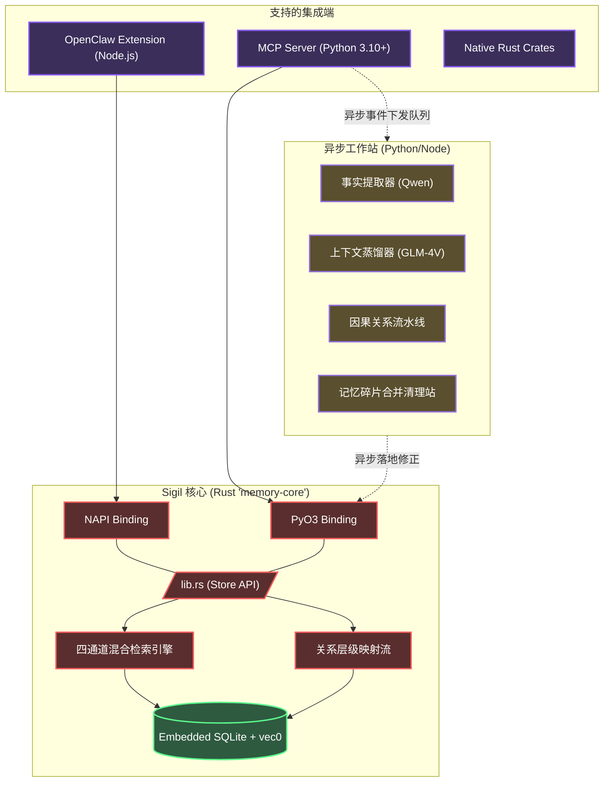

<div align="center">
  
  <h1>✧ Sigil 记忆系统</h1>
  <p><strong>专为自主智能体（AI Agents）打造的本地优先、高性能混合上下文数据库</strong></p>

  <p>
    <a href="README.md">English</a> | <a href="README.zh-CN.md"><b>简体中文</b></a>
  </p>

  <p>
    <a href="https://www.gnu.org/licenses/agpl-3.0"></a>
    
    
    
    
    
  </p>
</div>

---

## 📖 目录

- [概览](#-概览)
- [核心特性](#-核心特性)
- [因果工作台与记忆关联](#-因果工作台与记忆关联)
- [系统架构](#-系统架构)
- [模型栈](#-模型栈)
- [快速开始: 面向 Coding Agents (MCP)](#-快速开始-面向-coding-agents-mcp)
- [快速开始: 面向 OpenClaw 框架](#-快速开始-面向-openclaw-框架)
- [代码接入与 APIs](#-代码接入与-apis)
- [环境变量配置](#-环境变量配置)
- [性能基准](#-性能基准)
- [贡献指南](#-贡献指南)
- [开源协议](#-开源协议)

---

## 💡 概览

**Sigil**（魔法刻印/符文）是一个专门为纯自主智能体（Autonomous AI Agents）设计的一体化上下文和记忆管理系统。

目前主流的 AI 智能体记忆模型严重依赖于简单向量数据库和扁平化的片段列表。这不仅会让上下文视窗迅速膨胀导致响应变慢，还会失去长时期的逻辑因果联系。

Sigil 摒弃了简单扁平化的数据结构，转而采用由高度优化的 Rust 代码支撑的**层次化、类似文件系统的管理范式**，并内建了图谱式的因果节点追踪。无论你是搭建标准的 [Model Context Protocol (MCP)](https://modelcontextprotocol.io/) 服务器，还是扩展如 OpenClaw 这样的智能平台，Sigil 都能提供亚毫秒级的并行多通道混合语义检索能力——且**完全不需要依赖任何外部独立数据库**。

---

## ✨ 核心特性

- **⚡ 极速 Rust 内核 (`memory-core`)**：整个检索框架、数据存储、分级提取底层架构完全由 Rust 实现。支持了面向 Node.js (`NAPI-RS`) 和 Python (`PyO3`) 的多边环境原生绑定。
- **🗂️ 文件系统命名空间范式**：记忆信息会根据层级逻辑进行分治存放。通过 `path` 参数（例如：`/user/preferences`, `/project/architecture`）对记忆块进行结构化约束隔离。
- **🔍 四通道混合搜索引擎**：
  - **语义级（Semantic）**：内置 Voyage-4 向量处理，通过 `sqlite-vec` 形成 KNN 精准网络。
  - **词法级（Lexical）**：C 级别构建的 CJK（中日韩文）专用分词，由 `libsimple` + `FTS5` 双生执行。
  - **符号级（Symbolic）**：结构化的属性匹配（针对精确实体、参数、关键字配置）。
  - **遗忘曲线（Decay）**：启发自 ACT-R 经典认知模型的时间惩罚衰减。
- **🎯 交叉重排序（Reranking）**：在四个通道并行召回信息后，会自动激活行业顶尖的 Voyage Rerank-2.5 交叉编码器对混合候选结果实施最终调配。
- **🧠 三级自适应上下文坍缩**：自主把内容抽取出三个级别：`L0` (一句话核心), `L1` (段落摘要),  和 `L2` (完全内容备份)，极致节省模型的重复阅读成本与 Tokens 开销。
- **🔌 零运维负担体系**：所有数据闭环封装在一个单一的 SQLite 文件内 (`memory.db`)。不需要 Redis、不需要 Neo4j 分图、也不需要起个 ChromaDB。

---

## ⚙️ 因果工作台与记忆关联

自 `0.2.0` 版本起，Sigil 引入了过往仅在企业级图数据库中存在的深度推理管道组件：

### 1. 结构化因果提取管道 (The Causal Extraction Pipeline)
当 Agent 抛下大量单轮执行记录给后台时，完全异步挂载的因果工作台将启动。通过 SiliconFlow 平台接入 **Qwen3.5-27B** 智算框架，它深度解构 Agent 本次的输出以提取：
*   `Causes`：本次交互操作的直接触发动机和原场景。
*   `Decisions`：采取该方案背后的思考路径。
*   `Results`：坚实的执行结果结语。
*   `Impacts`：对此前历史或工作空间可能存在的长远波及影响。

这就彻底解决了所谓的 “Agent 遗忘症”—— 现有很多 AI 可能会记住“它改了什么代码”，但过两天它就会忘记“它为什么当初要这么改”。

### 2. 原生记忆拓扑关联 (Memory Relations)
底层 SQLite 表格中会显式挂载节点链接网络。从底层逻辑建立相互依存的事实网。即使 AI 只提及了子分支的问题线索，它也能平滑顺藤摸瓜地回溯整个依赖架构。

---

## 🏗️ 系统架构



---

## 🧩 模型栈

历经上千次内部测试与实打实的研发应用消耗对抗，在此为您奉上我们所推崇的选型推荐：

| 职位角色 | 推荐选用方案 | 选型原由底气 |
|------|-------------------|------------------|
| **特征向量 (Embedding)** | [Voyage-4](https://voyageai.com/) | 1024高维度向量呈现，其多语种文本匹配程度当下一流。**注册后直接享受 200M 免费基础分账额度**。 |
| **打分重排序 (Reranking)** | [Voyage Rerank-2.5](https://voyageai.com/) | 在海量基础检索后的深度互注意力校验提峰利器。和前一项共用一条 API Key。 |
| **因果关系提取中枢** | [Qwen3.5-27B](https://cloud.siliconflow.cn/i/QwFqsLF1) 分片部署 | 经过针对 JSON 数据校验、深度从句抽取极高鲁棒性对比的脱颖胜出者！其在硅基流动的注册即赠额度绝对亲民。 |
| **句级快摄 (Summarization)** | [Qwen3.5-27B](https://cloud.siliconflow.cn/i/QwFqsLF1) | 极速 L0 级一句话摘要生成。 |
| **全局蒸馏 (Distillation)** | [Qwen3.5-27B](https://cloud.siliconflow.cn/i/QwFqsLF1) | 周期性全局图谱与规则蒸馏衍生。 |

---

## 🤖 快速开始: 面向 Coding Agents (MCP 协议)

如果你使用的是 Claude Desktop, Cursor, 或 AutoGen 等开发伴侣，可以直接使用全自动封装好的 MCP 服务器。**给 AI 发送以下指令让他自行搭建：**

```text
帮我安装配置 Sigil —— 一个 AI agent 本地记忆系统。

1. 克隆仓库: git clone https://github.com/kckylechen1/sigil.git && cd sigil
2. 搭建 MCP server (执行虚拟环境与构建):
   cd mcp && python3 -m venv .venv && source .venv/bin/activate
   cd ../crates/memory-python && pip install maturin && maturin develop --release
   cd ../../mcp && pip install -r requirements.txt
3. 在我的 mcp_config.json 里追加:
   {
     "mcpServers": {
       "memory": {
         "command": "<绝对路径指向>/sigil/mcp/.venv/bin/python3",
         "args": ["<绝对路径指向>/sigil/mcp/server.py"]
       }
     }
   }

程序会在其主目录读取 .env 文件的变量体系参数，所以你无需在上面的 json 书写复杂的 env 对象。
如果本人尚未有 Voyage 或 SiliconFlow 的相关参数，请协助用户前去开户：
- Voyage API（向量嵌入+重排）: https://dash.voyageai.com/ — 免费 2 亿 tokens，无需信用卡绑定限制
- SiliconFlow（事实提取）: https://cloud.siliconflow.cn/i/QwFqsLF1 — 新注册即有免费调用量
```

---

## 🦞 快速开始: 面向 OpenClaw 框架

Sigil 作为最核心的记忆力外壳插件运行于您的节点架构之内。**将其发至终端或是对话窗交由 Agent：**

```text
帮我用一键脚本安装 Sigil 作为 OpenClaw 的本地扩展。

1. 直接唤起仓库部署流：
   bash -c "$(curl -fsSL https://raw.githubusercontent.com/kckylechen1/sigil/main/scripts/install_openclaw_ext.sh)"

2. 此套安装链将接替全管包下载、构建 NAPI-RS 高层封装库映射，完成基本冒烟测试（Smoke-test）并通过 Symlink 对齐到主进程下的 extensions 目标库。

3. 执行无误之后记得追加开启权限开关 `plugins.allow` 并在 `plugins.slots.memory` 设置指定节点为 `memory-hybrid-bridge`。最后完善 `.env` 各项钥匙串值。
```

---

## 💻 代码接入与 APIs

倘若您想在原生应用中内嵌本存储矩阵引擎：

### ⚙️ Python Environment (`mcp/server.py` 同效类)
```python
from memory_core_py import MemoryStore, SearchParams, MemoryEntry

# 根基生成
store = MemoryStore("~/.sigil/memory.db")

# 单条压入记录信息
store.save_memory(MemoryEntry(
    text="项目选用了带有 Vite 支撑特性的非典前端 React。禁止向业务掺离 Webpack 代码。可以准入 Tailwind 等样式生成器。",
    path="/user/project_preferences",
    importance=0.8,
    keywords=["react", "vite", "webpack", "tailwind"]
))

# 实施高维度联合查询检索
results = store._search(SearchParams(
    query="这个项目的打包工具有什么特别的倾向吗？",
    path_prefix="/user",
    top_k=3
))
print(results[0].l0_summary) # 只输出极致凝炼的中心要义点
```

### ⚙️ 环境变量配置 (`.env`)
通过拷贝根目录下 `.env.example` 为 `.env` 实现：
```bash
# 此处支撑整个大矩阵寻路检索及精确化纠偏
VOYAGE_API_KEY="您的_voyage_api_密钥"

# 面向推理、结构关系抽离，或段落切片
SILICONFLOW_API_KEY="您的_silicon_flow_密钥"

# 数据库生成绝对地址
MEMORY_DB_PATH="~/.sigil/memory.db"
```

---

## 🏎️ 性能基准 (Benchmarks)

- **原生执行 P95 查询延迟线 (Rust)**：绝大查询将不触发 `1.2ms` 障碍墙。
- **并发抽取分离**：经设计打磨完毕的线程池（ThreadPool）完美隔离计算节点对主网流与核心数据检索链的堵车隐患。
- **极度降低废弃 Token 率**：我们所自研的分级切块策略（`L0` → `L1` → `L2`）横向实测相较于一般传统长文本死板的 RAG 挂载法大幅缩减超 **85%** 上下文环境包袱累赘。使得大型 LLM 返回更稳定、遵循度表现直线上升。

---

## 🤝 贡献指南

任何开源的 PRs 或建设意见都是我们求之不得的财富。若是需要在本地构建起开发基线：
1. 你的电脑上最起码应该需要含有新世代版本的 Rust 链条 (`rustc>=1.75`)。
2. 安装对应所需的依赖工具库 `maturin` 以及 `cargo-watch` 提供辅助。
3. 可于主脉核心部分 `crates/memory-core/src/lib.rs` 切入。
4. 提供最终合拢合并之前请务必要确保证过掉全部基础检查：`cargo test --all`。

提交纪要格式务必迎合 [Conventional Commits](https://www.conventionalcommits.org/) 的基本规范准则。

---

## 📜 开源协议

基于 [AGPLv3 License](LICENSE) © 2026 Sigil Authors。
